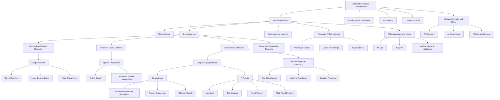

# AI Concept Map

A high-level Mermaid map connecting the major AI domains covered in this knowledge base.
For topic-level relationships, see each topic's "Related AI Topics" section.

## Domain Summary

| Domain | Core Hub Topic | Feeds Into |
|--------|-----------------|------------|
| AI Fundamentals | [[Artificial Intelligence Fundamentals]] | Machine Learning, Planning, Reasoning |
| Machine Learning | [[Machine Learning]] | ML Algorithms, Deep Learning, RL |
| Deep Learning | [[Deep Learning]] | NLP, Computer Vision, Generative AI |
| NLP | [[Natural Language Processing]] | Large Language Models, Dialogue Systems |
| Computer Vision | [[Computer Vision]] | Object Detection, Segmentation, Video Understanding |
| Speech & Voice AI | [[Speech Recognition]] | Text-to-Speech, Audio Generation |
| Generative AI | [[Generative AI]] | RAG, Prompt Engineering, AI Agents |
| AI Agents | [[AI Agents]] | Agentic AI, Tool-Using AI, Multi-Agent Systems |
| Advanced AI | [[Knowledge Graphs]] | Vector Databases, Explainable AI |
| AI Safety | [[Responsible AI]] | Alignment, Governance, Fairness |
| Infrastructure | [[MLOps]] | LLMOps, Edge AI, TinyML |
