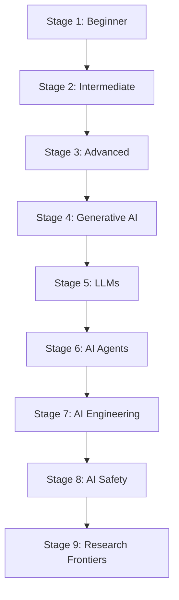

# AI Learning Roadmap

A suggested learning path through this knowledge base, from beginner foundations to advanced,
research-level topics. Each stage links to its prerequisite stage.

## Stage 1 — Beginner: AI Fundamentals
[[Artificial Intelligence Fundamentals]] -> [[Intelligent Agents]] -> [[Problem Solving in AI]] ->
[[State Space Search]] -> [[Breadth-First Search]] -> [[Depth-First Search]] -> [[Heuristic Search]]

## Stage 2 — Intermediate: Core Machine Learning
[[Machine Learning]] -> [[Supervised Learning]] -> [[Unsupervised Learning]] ->
[[Linear Regression]] -> [[Logistic Regression]] -> [[Decision Trees]] -> [[K-Means Clustering]]

## Stage 3 — Advanced: Deep Learning
[[Deep Learning]] -> [[Artificial Neural Networks]] -> [[Convolutional Neural Networks]] ->
[[Recurrent Neural Networks]] -> [[LSTM Networks]] -> [[Attention Mechanisms]] -> [[Residual Networks]]

## Stage 4 — Generative AI Foundations
[[Transformer Architecture]] -> [[Generative Adversarial Networks]] -> [[Variational Autoencoders]] ->
[[Diffusion Models]] -> [[Generative AI]]

## Stage 5 — Large Language Models
[[Large Language Models]] -> [[Foundation Models]] -> [[Prompt Engineering]] ->
[[Retrieval-Augmented Generation]] -> [[Vector Embeddings]] -> [[Vector Databases]]

## Stage 6 — AI Agents
[[AI Agents]] -> [[Agentic AI]] -> [[Tool-Using AI]] -> [[Function Calling]] ->
[[Agent Memory]] -> [[Agentic Workflow]] -> [[Multi-Agent Systems]] -> [[Reasoning AI]]

## Stage 7 — AI Engineering & Infrastructure
[[MLOps]] -> [[LLMOps]] -> [[Edge AI]] -> [[TinyML]] -> [[Automated Machine Learning (AutoML)]]

## Stage 8 — AI Safety, Security & Ethics
[[Responsible AI]] -> [[AI Alignment]] -> [[AI Governance]] -> [[AI Bias & Fairness]] ->
[[Adversarial Attacks]] -> [[AI Security]] -> [[Privacy-Preserving AI]]

## Stage 9 — Research Frontiers
[[Neuro-Symbolic AI]] -> [[Causal AI]] -> [[World Models]] -> [[Embodied AI]] ->
[[Artificial General Intelligence (AGI)]]

## Prerequisite Notes
- Stages 1-2 assume no prior AI/ML background.
- Stage 3 assumes comfort with the linear algebra and probability implicit in [[Machine Learning]].
- Stages 4-6 assume Stage 3 is complete, since LLMs and agents build on the [[Transformer Architecture]].
- Stage 8 can be studied in parallel with any stage from 3 onward — safety should not be an afterthought.
