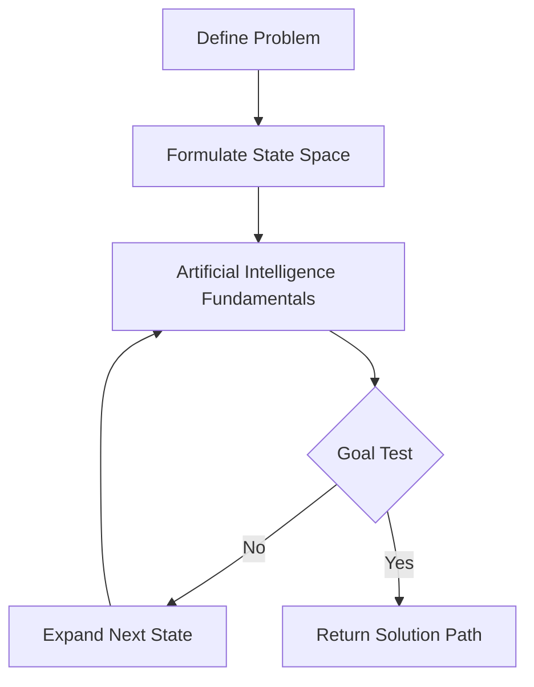

# Artificial Intelligence Fundamentals

## 1. Title
Artificial Intelligence Fundamentals

## 2. Definition
Artificial Intelligence is the field of computer science focused on building systems that perform tasks normally requiring human intelligence, such as perception, reasoning, learning, and decision-making.

## 3. What is it?
Artificial Intelligence Fundamentals refers to artificial Intelligence is the field of computer science focused on building systems that perform tasks normally requiring human intelligence, such as perception, reasoning, learning, and decision-making. It sits within the broader field of AI Fundamentals, and
is typically encountered when building systems that need to reason, perceive, or act intelligently.

## 4. Why is it important?
Artificial Intelligence Fundamentals matters because it provides a concrete, reusable building block for AI systems. Understanding
it allows practitioners to select the right technique for a given problem, reason about its trade-offs,
and combine it correctly with neighboring techniques such as [[Cognitive AI]], [[Computational Intelligence]].

## 5. Core Concepts
- The core mechanism described in the Definition above
- The role this topic plays within AI Fundamentals
- Its inputs, outputs, and evaluation criteria
- Its relationship to neighboring techniques in this knowledge base

## 6. How It Works
Artificial Intelligence Fundamentals operates by taking an input, applying its core mechanism, and producing an output that can be
evaluated or consumed downstream. The exact mechanics depend on the specific technique or algorithm used,
but the general pattern follows the diagram below.

## 7. Architecture / Workflow


## 8. Components
- **Input layer / data source** — the raw information the technique consumes
- **Core processing mechanism** — the algorithm, model, or architecture itself
- **Output / decision layer** — the prediction, action, or generated artifact
- **Evaluation / feedback loop** — the mechanism used to measure and improve performance

## 9. Algorithms / Techniques
Common algorithms and techniques associated with Artificial Intelligence Fundamentals include those used across AI Fundamentals, most
notably the neighboring methods listed in the Related AI Topics section below.

## 10. Mathematical Concepts
This topic is primarily architectural/conceptual. Its mathematical foundations are inherited from its constituent components — see the Related AI Topics and Wikilinks sections below for the specific techniques (e.g. gradient descent, probability, or linear algebra) that underpin it.

## 11. Input
Typical input: structured or unstructured data relevant to AI Fundamentals (e.g. numeric features, text,
images, audio, or graph-structured data), depending on the specific application.

## 12. Processing
The processing stage applies Artificial Intelligence Fundamentals's core mechanism (see How It Works and Architecture / Workflow)
to transform the input into an intermediate or final representation.

## 13. Output
Typical output: a prediction, classification, generated artifact, decision, or transformed representation,
depending on the task Artificial Intelligence Fundamentals is applied to.

## 14. Real-World Examples
- Industry systems that rely on Artificial Intelligence Fundamentals as a component of a larger pipeline
- Research prototypes demonstrating the core capability
- Open-source libraries and frameworks that implement it

## 15. Practical Applications
Artificial Intelligence Fundamentals is applied in domains such as ai fundamentals, and commonly intersects with adjacent fields
including Cognitive AI, Computational Intelligence, Intelligent Agents.

## 16. Advantages
- Provides a well-understood, reusable approach to its problem class
- Composable with other techniques in an AI pipeline
- Backed by established theory and/or empirical results

## 17. Limitations
- Performance depends heavily on data quality and problem framing
- May not generalize outside the assumptions it was designed under
- Can require significant compute, data, or tuning to work well in practice

## 18. Challenges
- Choosing the right variant or hyperparameters for a given task
- Evaluating performance fairly and avoiding data leakage or bias
- Integrating with production systems reliably and efficiently

## 19. Related AI Topics
- [[Cognitive AI]]
- [[Computational Intelligence]]
- [[Intelligent Agents]]
- [[Rational Agents]]
- [[Machine Learning]]
- [[Knowledge Representation]]

## 20. Prerequisites
A working understanding of [[Machine Learning]] and, where relevant, [[Artificial Intelligence Fundamentals]]
is recommended before studying Artificial Intelligence Fundamentals in depth.

## 21. Learning Path
1. Review foundational concepts in AI Fundamentals
2. Study the Core Concepts and How It Works sections above
3. Implement the Mini Practical Example below
4. Explore the Related AI Topics to see how Artificial Intelligence Fundamentals connects to the wider field

## 22. Common Terminology
- **Artificial Intelligence Fundamentals** — as defined above
- Terms shared with AI Fundamentals, including those introduced in linked topics

## 23. Example
A typical example of Artificial Intelligence Fundamentals in practice follows the Architecture / Workflow diagram: input data enters
the pipeline, Artificial Intelligence Fundamentals's mechanism is applied, and a usable output is produced for downstream consumption.

## 24. Mini Practical Example
```python
# Illustrative pseudocode for Artificial Intelligence Fundamentals
# Real implementations vary by framework (PyTorch, TensorFlow, scikit-learn, etc.)
def apply_artificial_intelligence_fundamentals(input_data):
    processed = preprocess(input_data)
    result = model(processed)
    return postprocess(result)
```

## 25. Comparison with Related Concepts
**Artificial Intelligence Fundamentals** is often discussed alongside [[Cognitive AI]] and [[Computational Intelligence]]. While related, Artificial Intelligence Fundamentals is distinguished by its specific role described in the Definition and How It Works sections above — the related topics represent neighboring techniques, prerequisites, or complementary approaches rather than interchangeable alternatives.

## 26. AI Agent Relevance
AI agents may use Artificial Intelligence Fundamentals as a supporting capability — for example, an agent might invoke it as a tool, use it during perception/preprocessing, or rely on it indirectly through a model it calls.

## 27. RAG / LLM Relevance
Artificial Intelligence Fundamentals can support LLM-based systems indirectly — for instance by preprocessing data, evaluating outputs, or providing structure that an LLM-based pipeline consumes.

## 28. Important Keywords
Artificial Intelligence Fundamentals, AI Fundamentals, Cognitive AI, Computational Intelligence, Intelligent Agents, Rational Agents

## 29. Related Obsidian Wikilinks
- [[Cognitive AI]]
- [[Computational Intelligence]]
- [[Intelligent Agents]]
- [[Rational Agents]]
- [[Machine Learning]]
- [[Knowledge Representation]]

## 30. Summary
Artificial Intelligence Fundamentals is a ai fundamentals technique that artificial Intelligence is the field of computer science focused on building systems that perform tasks normally requiring human intelligence, such as perception, reasoning, learning, and decision-making. It connects closely to
[[Cognitive AI]], [[Computational Intelligence]], [[Intelligent Agents]] within this knowledge base,
and forms part of the broader landscape of AI Fundamentals covered here.

---
*Part of the [[AI-Master-Index|AI Knowledge Base]] — Category: AI Fundamentals*
