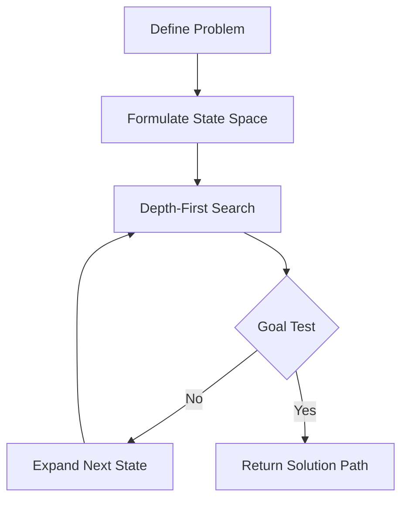

# Depth-First Search

## 1. Title
Depth-First Search

## 2. Definition
Depth-First Search (DFS) explores a state space by going as deep as possible along each branch before backtracking, using less memory than BFS but not guaranteeing shortest paths.

## 3. What is it?
Depth-First Search refers to depth-First Search (DFS) explores a state space by going as deep as possible along each branch before backtracking, using less memory than BFS but not guaranteeing shortest paths. It sits within the broader field of AI Fundamentals, and
is typically encountered when building systems that need to reason, perceive, or act intelligently.

## 4. Why is it important?
Depth-First Search matters because it provides a concrete, reusable building block for AI systems. Understanding
it allows practitioners to select the right technique for a given problem, reason about its trade-offs,
and combine it correctly with neighboring techniques such as [[State Space Search]], [[Breadth-First Search]].

## 5. Core Concepts
- The core mechanism described in the Definition above
- The role this topic plays within AI Fundamentals
- Its inputs, outputs, and evaluation criteria
- Its relationship to neighboring techniques in this knowledge base

## 6. How It Works
Depth-First Search operates by taking an input, applying its core mechanism, and producing an output that can be
evaluated or consumed downstream. The exact mechanics depend on the specific technique or algorithm used,
but the general pattern follows the diagram below.

## 7. Architecture / Workflow


## 8. Components
- **Input layer / data source** — the raw information the technique consumes
- **Core processing mechanism** — the algorithm, model, or architecture itself
- **Output / decision layer** — the prediction, action, or generated artifact
- **Evaluation / feedback loop** — the mechanism used to measure and improve performance

## 9. Algorithms / Techniques
Common algorithms and techniques associated with Depth-First Search include those used across AI Fundamentals, most
notably the neighboring methods listed in the Related AI Topics section below.

## 10. Mathematical Concepts
DFS complexity:

`Time = O(b^m)`  `Space = O(b*m)`

where `b` is the branching factor and `m` is the maximum depth of the search tree.

## 11. Input
Typical input: structured or unstructured data relevant to AI Fundamentals (e.g. numeric features, text,
images, audio, or graph-structured data), depending on the specific application.

## 12. Processing
The processing stage applies Depth-First Search's core mechanism (see How It Works and Architecture / Workflow)
to transform the input into an intermediate or final representation.

## 13. Output
Typical output: a prediction, classification, generated artifact, decision, or transformed representation,
depending on the task Depth-First Search is applied to.

## 14. Real-World Examples
- Industry systems that rely on Depth-First Search as a component of a larger pipeline
- Research prototypes demonstrating the core capability
- Open-source libraries and frameworks that implement it

## 15. Practical Applications
Depth-First Search is applied in domains such as ai fundamentals, and commonly intersects with adjacent fields
including State Space Search, Breadth-First Search, A* Search.

## 16. Advantages
- Provides a well-understood, reusable approach to its problem class
- Composable with other techniques in an AI pipeline
- Backed by established theory and/or empirical results

## 17. Limitations
- Performance depends heavily on data quality and problem framing
- May not generalize outside the assumptions it was designed under
- Can require significant compute, data, or tuning to work well in practice

## 18. Challenges
- Choosing the right variant or hyperparameters for a given task
- Evaluating performance fairly and avoiding data leakage or bias
- Integrating with production systems reliably and efficiently

## 19. Related AI Topics
- [[State Space Search]]
- [[Breadth-First Search]]
- [[A* Search]]
- [[Heuristic Search]]
- [[Artificial Intelligence Fundamentals]]
- [[Machine Learning]]
- [[Knowledge Representation]]

## 20. Prerequisites
A working understanding of [[Machine Learning]] and, where relevant, [[Artificial Intelligence Fundamentals]]
is recommended before studying Depth-First Search in depth.

## 21. Learning Path
1. Review foundational concepts in AI Fundamentals
2. Study the Core Concepts and How It Works sections above
3. Implement the Mini Practical Example below
4. Explore the Related AI Topics to see how Depth-First Search connects to the wider field

## 22. Common Terminology
- **Depth-First Search** — as defined above
- Terms shared with AI Fundamentals, including those introduced in linked topics

## 23. Example
A typical example of Depth-First Search in practice follows the Architecture / Workflow diagram: input data enters
the pipeline, Depth-First Search's mechanism is applied, and a usable output is produced for downstream consumption.

## 24. Mini Practical Example
```python
def dfs(graph, start, goal, visited=None):
    if visited is None:
        visited = set()
    visited.add(start)
    if start == goal:
        return [start]
    for neighbor in graph.get(start, []):
        if neighbor not in visited:
            path = dfs(graph, neighbor, goal, visited)
            if path:
                return [start] + path
    return None
```

## 25. Comparison with Related Concepts
**Depth-First Search** is often discussed alongside [[State Space Search]] and [[Breadth-First Search]]. While related, Depth-First Search is distinguished by its specific role described in the Definition and How It Works sections above — the related topics represent neighboring techniques, prerequisites, or complementary approaches rather than interchangeable alternatives.

## 26. AI Agent Relevance
AI agents may use Depth-First Search as a supporting capability — for example, an agent might invoke it as a tool, use it during perception/preprocessing, or rely on it indirectly through a model it calls.

## 27. RAG / LLM Relevance
Depth-First Search can support LLM-based systems indirectly — for instance by preprocessing data, evaluating outputs, or providing structure that an LLM-based pipeline consumes.

## 28. Important Keywords
Depth-First Search, AI Fundamentals, State Space Search, Breadth-First Search, A* Search, Heuristic Search

## 29. Related Obsidian Wikilinks
- [[State Space Search]]
- [[Breadth-First Search]]
- [[A* Search]]
- [[Heuristic Search]]
- [[Artificial Intelligence Fundamentals]]
- [[Machine Learning]]
- [[Knowledge Representation]]

## 30. Summary
Depth-First Search is a ai fundamentals technique that depth-First Search (DFS) explores a state space by going as deep as possible along each branch before backtracking, using less memory than BFS but not guaranteeing shortest paths. It connects closely to
[[State Space Search]], [[Breadth-First Search]], [[A* Search]] within this knowledge base,
and forms part of the broader landscape of AI Fundamentals covered here.

---
*Part of the [[AI-Master-Index|AI Knowledge Base]] — Category: AI Fundamentals*
