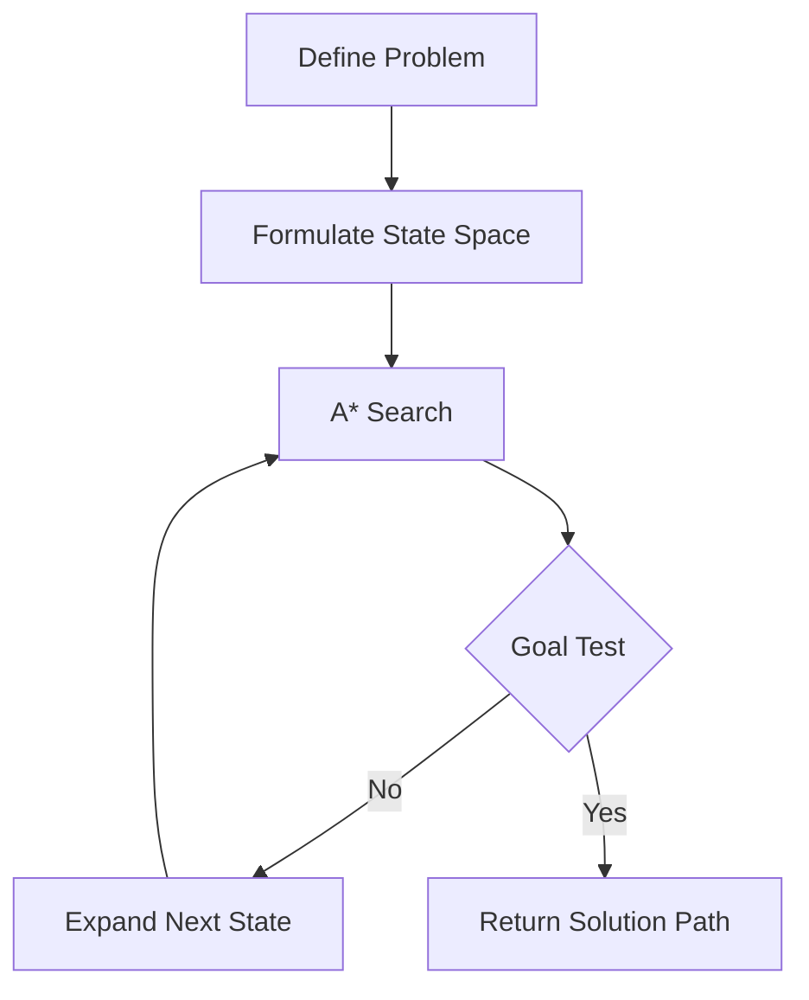

# A* Search

## 1. Title
A* Search

## 2. Definition
A* Search is an informed search algorithm that finds the lowest-cost path by combining the actual cost from the start (g) with a heuristic estimate to the goal (h).

## 3. What is it?
A* Search refers to a* Search is an informed search algorithm that finds the lowest-cost path by combining the actual cost from the start (g) with a heuristic estimate to the goal (h). It sits within the broader field of AI Fundamentals, and
is typically encountered when building systems that need to reason, perceive, or act intelligently.

## 4. Why is it important?
A* Search matters because it provides a concrete, reusable building block for AI systems. Understanding
it allows practitioners to select the right technique for a given problem, reason about its trade-offs,
and combine it correctly with neighboring techniques such as [[Breadth-First Search]], [[Depth-First Search]].

## 5. Core Concepts
- The core mechanism described in the Definition above
- The role this topic plays within AI Fundamentals
- Its inputs, outputs, and evaluation criteria
- Its relationship to neighboring techniques in this knowledge base

## 6. How It Works
A* Search operates by taking an input, applying its core mechanism, and producing an output that can be
evaluated or consumed downstream. The exact mechanics depend on the specific technique or algorithm used,
but the general pattern follows the diagram below.

## 7. Architecture / Workflow


## 8. Components
- **Input layer / data source** — the raw information the technique consumes
- **Core processing mechanism** — the algorithm, model, or architecture itself
- **Output / decision layer** — the prediction, action, or generated artifact
- **Evaluation / feedback loop** — the mechanism used to measure and improve performance

## 9. Algorithms / Techniques
Common algorithms and techniques associated with A* Search include those used across AI Fundamentals, most
notably the neighboring methods listed in the Related AI Topics section below.

## 10. Mathematical Concepts
A* evaluates nodes using:

`f(n) = g(n) + h(n)`

where `g(n)` is the cost from the start node to `n`, and `h(n)` is the heuristic estimate of the cost from `n` to the goal. A* is optimal when `h(n)` never overestimates the true cost (admissible).

## 11. Input
Typical input: structured or unstructured data relevant to AI Fundamentals (e.g. numeric features, text,
images, audio, or graph-structured data), depending on the specific application.

## 12. Processing
The processing stage applies A* Search's core mechanism (see How It Works and Architecture / Workflow)
to transform the input into an intermediate or final representation.

## 13. Output
Typical output: a prediction, classification, generated artifact, decision, or transformed representation,
depending on the task A* Search is applied to.

## 14. Real-World Examples
- Industry systems that rely on A* Search as a component of a larger pipeline
- Research prototypes demonstrating the core capability
- Open-source libraries and frameworks that implement it

## 15. Practical Applications
A* Search is applied in domains such as ai fundamentals, and commonly intersects with adjacent fields
including Breadth-First Search, Depth-First Search, Heuristic Search.

## 16. Advantages
- Provides a well-understood, reusable approach to its problem class
- Composable with other techniques in an AI pipeline
- Backed by established theory and/or empirical results

## 17. Limitations
- Performance depends heavily on data quality and problem framing
- May not generalize outside the assumptions it was designed under
- Can require significant compute, data, or tuning to work well in practice

## 18. Challenges
- Choosing the right variant or hyperparameters for a given task
- Evaluating performance fairly and avoiding data leakage or bias
- Integrating with production systems reliably and efficiently

## 19. Related AI Topics
- [[Breadth-First Search]]
- [[Depth-First Search]]
- [[Heuristic Search]]
- [[Constraint Satisfaction Problems]]
- [[Artificial Intelligence Fundamentals]]
- [[Machine Learning]]
- [[Knowledge Representation]]

## 20. Prerequisites
A working understanding of [[Machine Learning]] and, where relevant, [[Artificial Intelligence Fundamentals]]
is recommended before studying A* Search in depth.

## 21. Learning Path
1. Review foundational concepts in AI Fundamentals
2. Study the Core Concepts and How It Works sections above
3. Implement the Mini Practical Example below
4. Explore the Related AI Topics to see how A* Search connects to the wider field

## 22. Common Terminology
- **A* Search** — as defined above
- Terms shared with AI Fundamentals, including those introduced in linked topics

## 23. Example
A typical example of A* Search in practice follows the Architecture / Workflow diagram: input data enters
the pipeline, A* Search's mechanism is applied, and a usable output is produced for downstream consumption.

## 24. Mini Practical Example
```python
import heapq

def a_star(graph, start, goal, h):
    frontier = [(0, start, [start])]
    g_score = {start: 0}
    while frontier:
        f, node, path = heapq.heappop(frontier)
        if node == goal:
            return path
        for neighbor, cost in graph.get(node, []):
            new_g = g_score[node] + cost
            if neighbor not in g_score or new_g < g_score[neighbor]:
                g_score[neighbor] = new_g
                heapq.heappush(frontier, (new_g + h(neighbor), neighbor, path + [neighbor]))
    return None
```

## 25. Comparison with Related Concepts
**A* Search** is often discussed alongside [[Breadth-First Search]] and [[Depth-First Search]]. While related, A* Search is distinguished by its specific role described in the Definition and How It Works sections above — the related topics represent neighboring techniques, prerequisites, or complementary approaches rather than interchangeable alternatives.

## 26. AI Agent Relevance
AI agents may use A* Search as a supporting capability — for example, an agent might invoke it as a tool, use it during perception/preprocessing, or rely on it indirectly through a model it calls.

## 27. RAG / LLM Relevance
A* Search can support LLM-based systems indirectly — for instance by preprocessing data, evaluating outputs, or providing structure that an LLM-based pipeline consumes.

## 28. Important Keywords
A* Search, AI Fundamentals, Breadth-First Search, Depth-First Search, Heuristic Search, Constraint Satisfaction Problems

## 29. Related Obsidian Wikilinks
- [[Breadth-First Search]]
- [[Depth-First Search]]
- [[Heuristic Search]]
- [[Constraint Satisfaction Problems]]
- [[Artificial Intelligence Fundamentals]]
- [[Machine Learning]]
- [[Knowledge Representation]]

## 30. Summary
A* Search is a ai fundamentals technique that a* Search is an informed search algorithm that finds the lowest-cost path by combining the actual cost from the start (g) with a heuristic estimate to the goal (h). It connects closely to
[[Breadth-First Search]], [[Depth-First Search]], [[Heuristic Search]] within this knowledge base,
and forms part of the broader landscape of AI Fundamentals covered here.

---
*Part of the [[AI-Master-Index|AI Knowledge Base]] — Category: AI Fundamentals*
