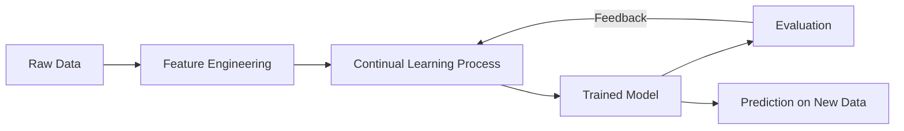

# Continual Learning

## 1. Title
Continual Learning

## 2. Definition
Continual learning enables a model to learn new tasks sequentially over time while retaining previously learned knowledge, avoiding catastrophic forgetting.

## 3. What is it?
Continual Learning refers to continual learning enables a model to learn new tasks sequentially over time while retaining previously learned knowledge, avoiding catastrophic forgetting. It sits within the broader field of Machine Learning, and
is typically encountered when building systems that need to learn from data.

## 4. Why is it important?
Continual Learning matters because it provides a concrete, reusable building block for AI systems. Understanding
it allows practitioners to select the right technique for a given problem, reason about its trade-offs,
and combine it correctly with neighboring techniques such as [[Transfer Learning]], [[Federated Learning]].

## 5. Core Concepts
- The core mechanism described in the Definition above
- The role this topic plays within Machine Learning
- Its inputs, outputs, and evaluation criteria
- Its relationship to neighboring techniques in this knowledge base

## 6. How It Works
Continual Learning operates by taking an input, applying its core mechanism, and producing an output that can be
evaluated or consumed downstream. The exact mechanics depend on the specific technique or algorithm used,
but the general pattern follows the diagram below.

## 7. Architecture / Workflow


## 8. Components
- **Input layer / data source** — the raw information the technique consumes
- **Core processing mechanism** — the algorithm, model, or architecture itself
- **Output / decision layer** — the prediction, action, or generated artifact
- **Evaluation / feedback loop** — the mechanism used to measure and improve performance

## 9. Algorithms / Techniques
Common algorithms and techniques associated with Continual Learning include those used across Machine Learning, most
notably the neighboring methods listed in the Related AI Topics section below.

## 10. Mathematical Concepts
This topic is primarily architectural/conceptual. Its mathematical foundations are inherited from its constituent components — see the Related AI Topics and Wikilinks sections below for the specific techniques (e.g. gradient descent, probability, or linear algebra) that underpin it.

## 11. Input
Typical input: structured or unstructured data relevant to Machine Learning (e.g. numeric features, text,
images, audio, or graph-structured data), depending on the specific application.

## 12. Processing
The processing stage applies Continual Learning's core mechanism (see How It Works and Architecture / Workflow)
to transform the input into an intermediate or final representation.

## 13. Output
Typical output: a prediction, classification, generated artifact, decision, or transformed representation,
depending on the task Continual Learning is applied to.

## 14. Real-World Examples
- Industry systems that rely on Continual Learning as a component of a larger pipeline
- Research prototypes demonstrating the core capability
- Open-source libraries and frameworks that implement it

## 15. Practical Applications
Continual Learning is applied in domains such as machine learning, and commonly intersects with adjacent fields
including Transfer Learning, Federated Learning, Meta Learning.

## 16. Advantages
- Provides a well-understood, reusable approach to its problem class
- Composable with other techniques in an AI pipeline
- Backed by established theory and/or empirical results

## 17. Limitations
- Performance depends heavily on data quality and problem framing
- May not generalize outside the assumptions it was designed under
- Can require significant compute, data, or tuning to work well in practice

## 18. Challenges
- Choosing the right variant or hyperparameters for a given task
- Evaluating performance fairly and avoiding data leakage or bias
- Integrating with production systems reliably and efficiently

## 19. Related AI Topics
- [[Transfer Learning]]
- [[Federated Learning]]
- [[Meta Learning]]
- [[Few-Shot Learning]]
- [[Machine Learning]]
- [[Artificial Intelligence Fundamentals]]
- [[Deep Learning]]

## 20. Prerequisites
A working understanding of [[Machine Learning]] and, where relevant, [[Artificial Intelligence Fundamentals]]
is recommended before studying Continual Learning in depth.

## 21. Learning Path
1. Review foundational concepts in Machine Learning
2. Study the Core Concepts and How It Works sections above
3. Implement the Mini Practical Example below
4. Explore the Related AI Topics to see how Continual Learning connects to the wider field

## 22. Common Terminology
- **Continual Learning** — as defined above
- Terms shared with Machine Learning, including those introduced in linked topics

## 23. Example
A typical example of Continual Learning in practice follows the Architecture / Workflow diagram: input data enters
the pipeline, Continual Learning's mechanism is applied, and a usable output is produced for downstream consumption.

## 24. Mini Practical Example
```python
# Illustrative pseudocode for Continual Learning
# Real implementations vary by framework (PyTorch, TensorFlow, scikit-learn, etc.)
def apply_continual_learning(input_data):
    processed = preprocess(input_data)
    result = model(processed)
    return postprocess(result)
```

## 25. Comparison with Related Concepts
**Continual Learning** is often discussed alongside [[Transfer Learning]] and [[Federated Learning]]. While related, Continual Learning is distinguished by its specific role described in the Definition and How It Works sections above — the related topics represent neighboring techniques, prerequisites, or complementary approaches rather than interchangeable alternatives.

## 26. AI Agent Relevance
AI agents may use Continual Learning as a supporting capability — for example, an agent might invoke it as a tool, use it during perception/preprocessing, or rely on it indirectly through a model it calls.

## 27. RAG / LLM Relevance
Continual Learning can support LLM-based systems indirectly — for instance by preprocessing data, evaluating outputs, or providing structure that an LLM-based pipeline consumes.

## 28. Important Keywords
Continual Learning, Machine Learning, Transfer Learning, Federated Learning, Meta Learning, Few-Shot Learning

## 29. Related Obsidian Wikilinks
- [[Transfer Learning]]
- [[Federated Learning]]
- [[Meta Learning]]
- [[Few-Shot Learning]]
- [[Machine Learning]]
- [[Artificial Intelligence Fundamentals]]
- [[Deep Learning]]

## 30. Summary
Continual Learning is a machine learning technique that continual learning enables a model to learn new tasks sequentially over time while retaining previously learned knowledge, avoiding catastrophic forgetting. It connects closely to
[[Transfer Learning]], [[Federated Learning]], [[Meta Learning]] within this knowledge base,
and forms part of the broader landscape of Machine Learning covered here.

---
*Part of the [[AI-Master-Index|AI Knowledge Base]] — Category: Machine Learning*
