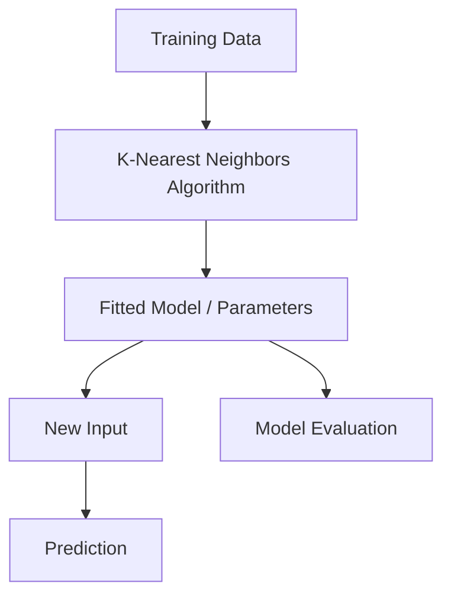

# K-Nearest Neighbors

## 1. Title
K-Nearest Neighbors

## 2. Definition
K-Nearest Neighbors classifies or predicts a new data point based on the majority class or average value of its K closest points in the training data.

## 3. What is it?
K-Nearest Neighbors refers to k-Nearest Neighbors classifies or predicts a new data point based on the majority class or average value of its K closest points in the training data. It sits within the broader field of ML Algorithms, and
is typically encountered when building systems that need to learn from data.

## 4. Why is it important?
K-Nearest Neighbors matters because it provides a concrete, reusable building block for AI systems. Understanding
it allows practitioners to select the right technique for a given problem, reason about its trade-offs,
and combine it correctly with neighboring techniques such as [[XGBoost]], [[Support Vector Machines]].

## 5. Core Concepts
- The core mechanism described in the Definition above
- The role this topic plays within ML Algorithms
- Its inputs, outputs, and evaluation criteria
- Its relationship to neighboring techniques in this knowledge base

## 6. How It Works
K-Nearest Neighbors operates by taking an input, applying its core mechanism, and producing an output that can be
evaluated or consumed downstream. The exact mechanics depend on the specific technique or algorithm used,
but the general pattern follows the diagram below.

## 7. Architecture / Workflow


## 8. Components
- **Input layer / data source** — the raw information the technique consumes
- **Core processing mechanism** — the algorithm, model, or architecture itself
- **Output / decision layer** — the prediction, action, or generated artifact
- **Evaluation / feedback loop** — the mechanism used to measure and improve performance

## 9. Algorithms / Techniques
Common algorithms and techniques associated with K-Nearest Neighbors include those used across ML Algorithms, most
notably the neighboring methods listed in the Related AI Topics section below.

## 10. Mathematical Concepts
KNN uses Euclidean distance to find neighbors:

`d(x,y) = sqrt(sum((x_i - y_i)^2))`

The predicted class is the majority vote among the K nearest neighbors.

## 11. Input
Typical input: structured or unstructured data relevant to ML Algorithms (e.g. numeric features, text,
images, audio, or graph-structured data), depending on the specific application.

## 12. Processing
The processing stage applies K-Nearest Neighbors's core mechanism (see How It Works and Architecture / Workflow)
to transform the input into an intermediate or final representation.

## 13. Output
Typical output: a prediction, classification, generated artifact, decision, or transformed representation,
depending on the task K-Nearest Neighbors is applied to.

## 14. Real-World Examples
- Industry systems that rely on K-Nearest Neighbors as a component of a larger pipeline
- Research prototypes demonstrating the core capability
- Open-source libraries and frameworks that implement it

## 15. Practical Applications
K-Nearest Neighbors is applied in domains such as ml algorithms, and commonly intersects with adjacent fields
including XGBoost, Support Vector Machines, Naive Bayes.

## 16. Advantages
- Provides a well-understood, reusable approach to its problem class
- Composable with other techniques in an AI pipeline
- Backed by established theory and/or empirical results

## 17. Limitations
- Performance depends heavily on data quality and problem framing
- May not generalize outside the assumptions it was designed under
- Can require significant compute, data, or tuning to work well in practice

## 18. Challenges
- Choosing the right variant or hyperparameters for a given task
- Evaluating performance fairly and avoiding data leakage or bias
- Integrating with production systems reliably and efficiently

## 19. Related AI Topics
- [[XGBoost]]
- [[Support Vector Machines]]
- [[Naive Bayes]]
- [[K-Means Clustering]]
- [[Machine Learning]]
- [[Predictive Modeling]]

## 20. Prerequisites
A working understanding of [[Machine Learning]] and, where relevant, [[Artificial Intelligence Fundamentals]]
is recommended before studying K-Nearest Neighbors in depth.

## 21. Learning Path
1. Review foundational concepts in ML Algorithms
2. Study the Core Concepts and How It Works sections above
3. Implement the Mini Practical Example below
4. Explore the Related AI Topics to see how K-Nearest Neighbors connects to the wider field

## 22. Common Terminology
- **K-Nearest Neighbors** — as defined above
- Terms shared with ML Algorithms, including those introduced in linked topics

## 23. Example
A typical example of K-Nearest Neighbors in practice follows the Architecture / Workflow diagram: input data enters
the pipeline, K-Nearest Neighbors's mechanism is applied, and a usable output is produced for downstream consumption.

## 24. Mini Practical Example
```python
from sklearn.neighbors import KNeighborsClassifier

knn = KNeighborsClassifier(n_neighbors=3)
knn.fit(X_train, y_train)
print(knn.predict(X_test))
```

## 25. Comparison with Related Concepts
**K-Nearest Neighbors** is often discussed alongside [[XGBoost]] and [[Support Vector Machines]]. While related, K-Nearest Neighbors is distinguished by its specific role described in the Definition and How It Works sections above — the related topics represent neighboring techniques, prerequisites, or complementary approaches rather than interchangeable alternatives.

## 26. AI Agent Relevance
AI agents may use K-Nearest Neighbors as a supporting capability — for example, an agent might invoke it as a tool, use it during perception/preprocessing, or rely on it indirectly through a model it calls.

## 27. RAG / LLM Relevance
K-Nearest Neighbors can support LLM-based systems indirectly — for instance by preprocessing data, evaluating outputs, or providing structure that an LLM-based pipeline consumes.

## 28. Important Keywords
K-Nearest Neighbors, ML Algorithms, XGBoost, Support Vector Machines, Naive Bayes, K-Means Clustering

## 29. Related Obsidian Wikilinks
- [[XGBoost]]
- [[Support Vector Machines]]
- [[Naive Bayes]]
- [[K-Means Clustering]]
- [[Machine Learning]]
- [[Predictive Modeling]]

## 30. Summary
K-Nearest Neighbors is a ml algorithms technique that k-Nearest Neighbors classifies or predicts a new data point based on the majority class or average value of its K closest points in the training data. It connects closely to
[[XGBoost]], [[Support Vector Machines]], [[Naive Bayes]] within this knowledge base,
and forms part of the broader landscape of ML Algorithms covered here.

---
*Part of the [[AI-Master-Index|AI Knowledge Base]] — Category: ML Algorithms*
