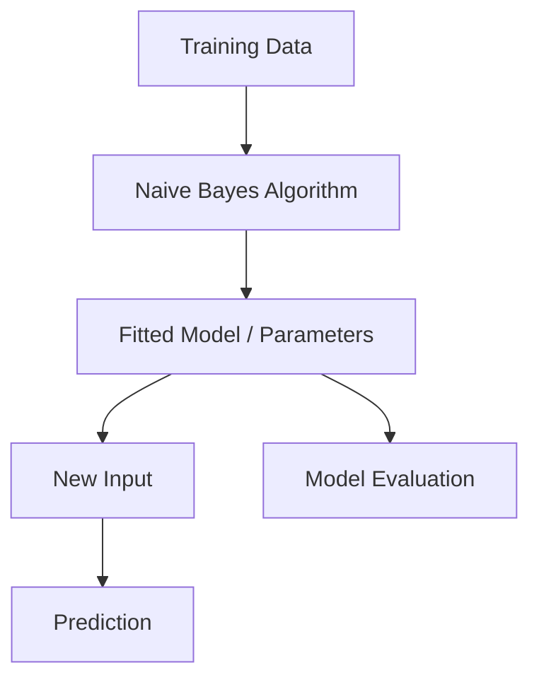

# Naive Bayes

## 1. Title
Naive Bayes

## 2. Definition
Naive Bayes is a probabilistic classifier based on Bayes' theorem that assumes features are conditionally independent given the class label.

## 3. What is it?
Naive Bayes refers to naive Bayes is a probabilistic classifier based on Bayes' theorem that assumes features are conditionally independent given the class label. It sits within the broader field of ML Algorithms, and
is typically encountered when building systems that need to learn from data.

## 4. Why is it important?
Naive Bayes matters because it provides a concrete, reusable building block for AI systems. Understanding
it allows practitioners to select the right technique for a given problem, reason about its trade-offs,
and combine it correctly with neighboring techniques such as [[Support Vector Machines]], [[K-Nearest Neighbors]].

## 5. Core Concepts
- The core mechanism described in the Definition above
- The role this topic plays within ML Algorithms
- Its inputs, outputs, and evaluation criteria
- Its relationship to neighboring techniques in this knowledge base

## 6. How It Works
Naive Bayes operates by taking an input, applying its core mechanism, and producing an output that can be
evaluated or consumed downstream. The exact mechanics depend on the specific technique or algorithm used,
but the general pattern follows the diagram below.

## 7. Architecture / Workflow


## 8. Components
- **Input layer / data source** — the raw information the technique consumes
- **Core processing mechanism** — the algorithm, model, or architecture itself
- **Output / decision layer** — the prediction, action, or generated artifact
- **Evaluation / feedback loop** — the mechanism used to measure and improve performance

## 9. Algorithms / Techniques
Common algorithms and techniques associated with Naive Bayes include those used across ML Algorithms, most
notably the neighboring methods listed in the Related AI Topics section below.

## 10. Mathematical Concepts
Naive Bayes classifies using:

`P(class|features) proportional to P(class) * product(P(feature_i|class))`

assuming conditional independence between features.

## 11. Input
Typical input: structured or unstructured data relevant to ML Algorithms (e.g. numeric features, text,
images, audio, or graph-structured data), depending on the specific application.

## 12. Processing
The processing stage applies Naive Bayes's core mechanism (see How It Works and Architecture / Workflow)
to transform the input into an intermediate or final representation.

## 13. Output
Typical output: a prediction, classification, generated artifact, decision, or transformed representation,
depending on the task Naive Bayes is applied to.

## 14. Real-World Examples
- Industry systems that rely on Naive Bayes as a component of a larger pipeline
- Research prototypes demonstrating the core capability
- Open-source libraries and frameworks that implement it

## 15. Practical Applications
Naive Bayes is applied in domains such as ml algorithms, and commonly intersects with adjacent fields
including Support Vector Machines, K-Nearest Neighbors, K-Means Clustering.

## 16. Advantages
- Provides a well-understood, reusable approach to its problem class
- Composable with other techniques in an AI pipeline
- Backed by established theory and/or empirical results

## 17. Limitations
- Performance depends heavily on data quality and problem framing
- May not generalize outside the assumptions it was designed under
- Can require significant compute, data, or tuning to work well in practice

## 18. Challenges
- Choosing the right variant or hyperparameters for a given task
- Evaluating performance fairly and avoiding data leakage or bias
- Integrating with production systems reliably and efficiently

## 19. Related AI Topics
- [[Support Vector Machines]]
- [[K-Nearest Neighbors]]
- [[K-Means Clustering]]
- [[Hierarchical Clustering]]
- [[Machine Learning]]
- [[Predictive Modeling]]

## 20. Prerequisites
A working understanding of [[Machine Learning]] and, where relevant, [[Artificial Intelligence Fundamentals]]
is recommended before studying Naive Bayes in depth.

## 21. Learning Path
1. Review foundational concepts in ML Algorithms
2. Study the Core Concepts and How It Works sections above
3. Implement the Mini Practical Example below
4. Explore the Related AI Topics to see how Naive Bayes connects to the wider field

## 22. Common Terminology
- **Naive Bayes** — as defined above
- Terms shared with ML Algorithms, including those introduced in linked topics

## 23. Example
A typical example of Naive Bayes in practice follows the Architecture / Workflow diagram: input data enters
the pipeline, Naive Bayes's mechanism is applied, and a usable output is produced for downstream consumption.

## 24. Mini Practical Example
```python
# Illustrative pseudocode for Naive Bayes
# Real implementations vary by framework (PyTorch, TensorFlow, scikit-learn, etc.)
def apply_naive_bayes(input_data):
    processed = preprocess(input_data)
    result = model(processed)
    return postprocess(result)
```

## 25. Comparison with Related Concepts
**Naive Bayes** is often discussed alongside [[Support Vector Machines]] and [[K-Nearest Neighbors]]. While related, Naive Bayes is distinguished by its specific role described in the Definition and How It Works sections above — the related topics represent neighboring techniques, prerequisites, or complementary approaches rather than interchangeable alternatives.

## 26. AI Agent Relevance
AI agents may use Naive Bayes as a supporting capability — for example, an agent might invoke it as a tool, use it during perception/preprocessing, or rely on it indirectly through a model it calls.

## 27. RAG / LLM Relevance
Naive Bayes can support LLM-based systems indirectly — for instance by preprocessing data, evaluating outputs, or providing structure that an LLM-based pipeline consumes.

## 28. Important Keywords
Naive Bayes, ML Algorithms, Support Vector Machines, K-Nearest Neighbors, K-Means Clustering, Hierarchical Clustering

## 29. Related Obsidian Wikilinks
- [[Support Vector Machines]]
- [[K-Nearest Neighbors]]
- [[K-Means Clustering]]
- [[Hierarchical Clustering]]
- [[Machine Learning]]
- [[Predictive Modeling]]

## 30. Summary
Naive Bayes is a ml algorithms technique that naive Bayes is a probabilistic classifier based on Bayes' theorem that assumes features are conditionally independent given the class label. It connects closely to
[[Support Vector Machines]], [[K-Nearest Neighbors]], [[K-Means Clustering]] within this knowledge base,
and forms part of the broader landscape of ML Algorithms covered here.

---
*Part of the [[AI-Master-Index|AI Knowledge Base]] — Category: ML Algorithms*
