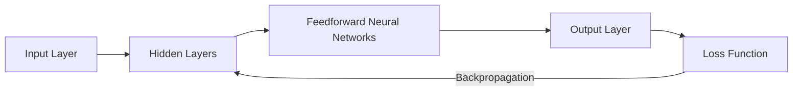

# Feedforward Neural Networks

## 1. Title
Feedforward Neural Networks

## 2. Definition
A Feedforward Neural Network passes information in one direction, from input through hidden layers to output, with no cycles or feedback connections.

## 3. What is it?
Feedforward Neural Networks refers to a Feedforward Neural Network passes information in one direction, from input through hidden layers to output, with no cycles or feedback connections. It sits within the broader field of Deep Learning, and
is typically encountered when building systems that need to learn from data.

## 4. Why is it important?
Feedforward Neural Networks matters because it provides a concrete, reusable building block for AI systems. Understanding
it allows practitioners to select the right technique for a given problem, reason about its trade-offs,
and combine it correctly with neighboring techniques such as [[Perceptron]], [[Multilayer Perceptron]].

## 5. Core Concepts
- The core mechanism described in the Definition above
- The role this topic plays within Deep Learning
- Its inputs, outputs, and evaluation criteria
- Its relationship to neighboring techniques in this knowledge base

## 6. How It Works
Feedforward Neural Networks operates by taking an input, applying its core mechanism, and producing an output that can be
evaluated or consumed downstream. The exact mechanics depend on the specific technique or algorithm used,
but the general pattern follows the diagram below.

## 7. Architecture / Workflow


## 8. Components
- **Input layer / data source** — the raw information the technique consumes
- **Core processing mechanism** — the algorithm, model, or architecture itself
- **Output / decision layer** — the prediction, action, or generated artifact
- **Evaluation / feedback loop** — the mechanism used to measure and improve performance

## 9. Algorithms / Techniques
Common algorithms and techniques associated with Feedforward Neural Networks include those used across Deep Learning, most
notably the neighboring methods listed in the Related AI Topics section below.

## 10. Mathematical Concepts
This topic is primarily architectural/conceptual. Its mathematical foundations are inherited from its constituent components — see the Related AI Topics and Wikilinks sections below for the specific techniques (e.g. gradient descent, probability, or linear algebra) that underpin it.

## 11. Input
Typical input: structured or unstructured data relevant to Deep Learning (e.g. numeric features, text,
images, audio, or graph-structured data), depending on the specific application.

## 12. Processing
The processing stage applies Feedforward Neural Networks's core mechanism (see How It Works and Architecture / Workflow)
to transform the input into an intermediate or final representation.

## 13. Output
Typical output: a prediction, classification, generated artifact, decision, or transformed representation,
depending on the task Feedforward Neural Networks is applied to.

## 14. Real-World Examples
- Industry systems that rely on Feedforward Neural Networks as a component of a larger pipeline
- Research prototypes demonstrating the core capability
- Open-source libraries and frameworks that implement it

## 15. Practical Applications
Feedforward Neural Networks is applied in domains such as deep learning, and commonly intersects with adjacent fields
including Perceptron, Multilayer Perceptron, Convolutional Neural Networks.

## 16. Advantages
- Provides a well-understood, reusable approach to its problem class
- Composable with other techniques in an AI pipeline
- Backed by established theory and/or empirical results

## 17. Limitations
- Performance depends heavily on data quality and problem framing
- May not generalize outside the assumptions it was designed under
- Can require significant compute, data, or tuning to work well in practice

## 18. Challenges
- Choosing the right variant or hyperparameters for a given task
- Evaluating performance fairly and avoiding data leakage or bias
- Integrating with production systems reliably and efficiently

## 19. Related AI Topics
- [[Perceptron]]
- [[Multilayer Perceptron]]
- [[Convolutional Neural Networks]]
- [[Recurrent Neural Networks]]
- [[Deep Learning]]
- [[Machine Learning]]
- [[Transformer Architecture]]

## 20. Prerequisites
A working understanding of [[Machine Learning]] and, where relevant, [[Artificial Intelligence Fundamentals]]
is recommended before studying Feedforward Neural Networks in depth.

## 21. Learning Path
1. Review foundational concepts in Deep Learning
2. Study the Core Concepts and How It Works sections above
3. Implement the Mini Practical Example below
4. Explore the Related AI Topics to see how Feedforward Neural Networks connects to the wider field

## 22. Common Terminology
- **Feedforward Neural Networks** — as defined above
- Terms shared with Deep Learning, including those introduced in linked topics

## 23. Example
A typical example of Feedforward Neural Networks in practice follows the Architecture / Workflow diagram: input data enters
the pipeline, Feedforward Neural Networks's mechanism is applied, and a usable output is produced for downstream consumption.

## 24. Mini Practical Example
```python
# Illustrative pseudocode for Feedforward Neural Networks
# Real implementations vary by framework (PyTorch, TensorFlow, scikit-learn, etc.)
def apply_feedforward_neural_networks(input_data):
    processed = preprocess(input_data)
    result = model(processed)
    return postprocess(result)
```

## 25. Comparison with Related Concepts
**Feedforward Neural Networks** is often discussed alongside [[Perceptron]] and [[Multilayer Perceptron]]. While related, Feedforward Neural Networks is distinguished by its specific role described in the Definition and How It Works sections above — the related topics represent neighboring techniques, prerequisites, or complementary approaches rather than interchangeable alternatives.

## 26. AI Agent Relevance
AI agents may use Feedforward Neural Networks as a supporting capability — for example, an agent might invoke it as a tool, use it during perception/preprocessing, or rely on it indirectly through a model it calls.

## 27. RAG / LLM Relevance
Feedforward Neural Networks can support LLM-based systems indirectly — for instance by preprocessing data, evaluating outputs, or providing structure that an LLM-based pipeline consumes.

## 28. Important Keywords
Feedforward Neural Networks, Deep Learning, Perceptron, Multilayer Perceptron, Convolutional Neural Networks, Recurrent Neural Networks

## 29. Related Obsidian Wikilinks
- [[Perceptron]]
- [[Multilayer Perceptron]]
- [[Convolutional Neural Networks]]
- [[Recurrent Neural Networks]]
- [[Deep Learning]]
- [[Machine Learning]]
- [[Transformer Architecture]]

## 30. Summary
Feedforward Neural Networks is a deep learning technique that a Feedforward Neural Network passes information in one direction, from input through hidden layers to output, with no cycles or feedback connections. It connects closely to
[[Perceptron]], [[Multilayer Perceptron]], [[Convolutional Neural Networks]] within this knowledge base,
and forms part of the broader landscape of Deep Learning covered here.

---
*Part of the [[AI-Master-Index|AI Knowledge Base]] — Category: Deep Learning*
