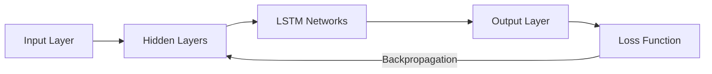

# LSTM Networks

## 1. Title
LSTM Networks

## 2. Definition
Long Short-Term Memory (LSTM) networks are a type of RNN with gating mechanisms that allow them to learn long-range dependencies while avoiding vanishing gradients.

## 3. What is it?
LSTM Networks refers to long Short-Term Memory (LSTM) networks are a type of RNN with gating mechanisms that allow them to learn long-range dependencies while avoiding vanishing gradients. It sits within the broader field of Deep Learning, and
is typically encountered when building systems that need to learn from data.

## 4. Why is it important?
LSTM Networks matters because it provides a concrete, reusable building block for AI systems. Understanding
it allows practitioners to select the right technique for a given problem, reason about its trade-offs,
and combine it correctly with neighboring techniques such as [[Convolutional Neural Networks]], [[Recurrent Neural Networks]].

## 5. Core Concepts
- The core mechanism described in the Definition above
- The role this topic plays within Deep Learning
- Its inputs, outputs, and evaluation criteria
- Its relationship to neighboring techniques in this knowledge base

## 6. How It Works
LSTM Networks operates by taking an input, applying its core mechanism, and producing an output that can be
evaluated or consumed downstream. The exact mechanics depend on the specific technique or algorithm used,
but the general pattern follows the diagram below.

## 7. Architecture / Workflow


## 8. Components
- **Input layer / data source** — the raw information the technique consumes
- **Core processing mechanism** — the algorithm, model, or architecture itself
- **Output / decision layer** — the prediction, action, or generated artifact
- **Evaluation / feedback loop** — the mechanism used to measure and improve performance

## 9. Algorithms / Techniques
Common algorithms and techniques associated with LSTM Networks include those used across Deep Learning, most
notably the neighboring methods listed in the Related AI Topics section below.

## 10. Mathematical Concepts
This topic is primarily architectural/conceptual. Its mathematical foundations are inherited from its constituent components — see the Related AI Topics and Wikilinks sections below for the specific techniques (e.g. gradient descent, probability, or linear algebra) that underpin it.

## 11. Input
Typical input: structured or unstructured data relevant to Deep Learning (e.g. numeric features, text,
images, audio, or graph-structured data), depending on the specific application.

## 12. Processing
The processing stage applies LSTM Networks's core mechanism (see How It Works and Architecture / Workflow)
to transform the input into an intermediate or final representation.

## 13. Output
Typical output: a prediction, classification, generated artifact, decision, or transformed representation,
depending on the task LSTM Networks is applied to.

## 14. Real-World Examples
- Industry systems that rely on LSTM Networks as a component of a larger pipeline
- Research prototypes demonstrating the core capability
- Open-source libraries and frameworks that implement it

## 15. Practical Applications
LSTM Networks is applied in domains such as deep learning, and commonly intersects with adjacent fields
including Convolutional Neural Networks, Recurrent Neural Networks, GRU Networks.

## 16. Advantages
- Provides a well-understood, reusable approach to its problem class
- Composable with other techniques in an AI pipeline
- Backed by established theory and/or empirical results

## 17. Limitations
- Performance depends heavily on data quality and problem framing
- May not generalize outside the assumptions it was designed under
- Can require significant compute, data, or tuning to work well in practice

## 18. Challenges
- Choosing the right variant or hyperparameters for a given task
- Evaluating performance fairly and avoiding data leakage or bias
- Integrating with production systems reliably and efficiently

## 19. Related AI Topics
- [[Convolutional Neural Networks]]
- [[Recurrent Neural Networks]]
- [[GRU Networks]]
- [[Autoencoders]]
- [[Deep Learning]]
- [[Machine Learning]]
- [[Transformer Architecture]]

## 20. Prerequisites
A working understanding of [[Machine Learning]] and, where relevant, [[Artificial Intelligence Fundamentals]]
is recommended before studying LSTM Networks in depth.

## 21. Learning Path
1. Review foundational concepts in Deep Learning
2. Study the Core Concepts and How It Works sections above
3. Implement the Mini Practical Example below
4. Explore the Related AI Topics to see how LSTM Networks connects to the wider field

## 22. Common Terminology
- **LSTM Networks** — as defined above
- Terms shared with Deep Learning, including those introduced in linked topics

## 23. Example
A typical example of LSTM Networks in practice follows the Architecture / Workflow diagram: input data enters
the pipeline, LSTM Networks's mechanism is applied, and a usable output is produced for downstream consumption.

## 24. Mini Practical Example
```python
import torch.nn as nn

lstm = nn.LSTM(input_size=10, hidden_size=20, batch_first=True)
output, (h_n, c_n) = lstm(input_tensor)
```

## 25. Comparison with Related Concepts
**LSTM Networks** is often discussed alongside [[Convolutional Neural Networks]] and [[Recurrent Neural Networks]]. While related, LSTM Networks is distinguished by its specific role described in the Definition and How It Works sections above — the related topics represent neighboring techniques, prerequisites, or complementary approaches rather than interchangeable alternatives.

## 26. AI Agent Relevance
AI agents may use LSTM Networks as a supporting capability — for example, an agent might invoke it as a tool, use it during perception/preprocessing, or rely on it indirectly through a model it calls.

## 27. RAG / LLM Relevance
LSTM Networks can support LLM-based systems indirectly — for instance by preprocessing data, evaluating outputs, or providing structure that an LLM-based pipeline consumes.

## 28. Important Keywords
LSTM Networks, Deep Learning, Convolutional Neural Networks, Recurrent Neural Networks, GRU Networks, Autoencoders

## 29. Related Obsidian Wikilinks
- [[Convolutional Neural Networks]]
- [[Recurrent Neural Networks]]
- [[GRU Networks]]
- [[Autoencoders]]
- [[Deep Learning]]
- [[Machine Learning]]
- [[Transformer Architecture]]

## 30. Summary
LSTM Networks is a deep learning technique that long Short-Term Memory (LSTM) networks are a type of RNN with gating mechanisms that allow them to learn long-range dependencies while avoiding vanishing gradients. It connects closely to
[[Convolutional Neural Networks]], [[Recurrent Neural Networks]], [[GRU Networks]] within this knowledge base,
and forms part of the broader landscape of Deep Learning covered here.

---
*Part of the [[AI-Master-Index|AI Knowledge Base]] — Category: Deep Learning*
