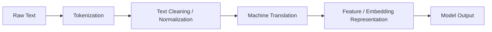

# Machine Translation

## 1. Title
Machine Translation

## 2. Definition
Machine translation automatically converts text or speech from one natural language to another using statistical or neural models.

## 3. What is it?
Machine Translation refers to machine translation automatically converts text or speech from one natural language to another using statistical or neural models. It sits within the broader field of NLP, and
is typically encountered when building systems that need to reason, perceive, or act intelligently.

## 4. Why is it important?
Machine Translation matters because it provides a concrete, reusable building block for AI systems. Understanding
it allows practitioners to select the right technique for a given problem, reason about its trade-offs,
and combine it correctly with neighboring techniques such as [[Intent Recognition]], [[Text Summarization]].

## 5. Core Concepts
- The core mechanism described in the Definition above
- The role this topic plays within NLP
- Its inputs, outputs, and evaluation criteria
- Its relationship to neighboring techniques in this knowledge base

## 6. How It Works
Machine Translation operates by taking an input, applying its core mechanism, and producing an output that can be
evaluated or consumed downstream. The exact mechanics depend on the specific technique or algorithm used,
but the general pattern follows the diagram below.

## 7. Architecture / Workflow


## 8. Components
- **Input layer / data source** — the raw information the technique consumes
- **Core processing mechanism** — the algorithm, model, or architecture itself
- **Output / decision layer** — the prediction, action, or generated artifact
- **Evaluation / feedback loop** — the mechanism used to measure and improve performance

## 9. Algorithms / Techniques
Common algorithms and techniques associated with Machine Translation include those used across NLP, most
notably the neighboring methods listed in the Related AI Topics section below.

## 10. Mathematical Concepts
This topic is primarily architectural/conceptual. Its mathematical foundations are inherited from its constituent components — see the Related AI Topics and Wikilinks sections below for the specific techniques (e.g. gradient descent, probability, or linear algebra) that underpin it.

## 11. Input
Typical input: structured or unstructured data relevant to NLP (e.g. numeric features, text,
images, audio, or graph-structured data), depending on the specific application.

## 12. Processing
The processing stage applies Machine Translation's core mechanism (see How It Works and Architecture / Workflow)
to transform the input into an intermediate or final representation.

## 13. Output
Typical output: a prediction, classification, generated artifact, decision, or transformed representation,
depending on the task Machine Translation is applied to.

## 14. Real-World Examples
- Industry systems that rely on Machine Translation as a component of a larger pipeline
- Research prototypes demonstrating the core capability
- Open-source libraries and frameworks that implement it

## 15. Practical Applications
Machine Translation is applied in domains such as nlp, and commonly intersects with adjacent fields
including Intent Recognition, Text Summarization, Question Answering.

## 16. Advantages
- Provides a well-understood, reusable approach to its problem class
- Composable with other techniques in an AI pipeline
- Backed by established theory and/or empirical results

## 17. Limitations
- Performance depends heavily on data quality and problem framing
- May not generalize outside the assumptions it was designed under
- Can require significant compute, data, or tuning to work well in practice

## 18. Challenges
- Choosing the right variant or hyperparameters for a given task
- Evaluating performance fairly and avoiding data leakage or bias
- Integrating with production systems reliably and efficiently

## 19. Related AI Topics
- [[Intent Recognition]]
- [[Text Summarization]]
- [[Question Answering]]
- [[Information Extraction]]
- [[Natural Language Processing]]
- [[Machine Learning]]
- [[Large Language Models]]

## 20. Prerequisites
A working understanding of [[Machine Learning]] and, where relevant, [[Artificial Intelligence Fundamentals]]
is recommended before studying Machine Translation in depth.

## 21. Learning Path
1. Review foundational concepts in NLP
2. Study the Core Concepts and How It Works sections above
3. Implement the Mini Practical Example below
4. Explore the Related AI Topics to see how Machine Translation connects to the wider field

## 22. Common Terminology
- **Machine Translation** — as defined above
- Terms shared with NLP, including those introduced in linked topics

## 23. Example
A typical example of Machine Translation in practice follows the Architecture / Workflow diagram: input data enters
the pipeline, Machine Translation's mechanism is applied, and a usable output is produced for downstream consumption.

## 24. Mini Practical Example
```python
from transformers import pipeline

translator = pipeline("translation_en_to_fr")
print(translator("Artificial intelligence is transforming the world."))
```

## 25. Comparison with Related Concepts
**Machine Translation** is often discussed alongside [[Intent Recognition]] and [[Text Summarization]]. While related, Machine Translation is distinguished by its specific role described in the Definition and How It Works sections above — the related topics represent neighboring techniques, prerequisites, or complementary approaches rather than interchangeable alternatives.

## 26. AI Agent Relevance
AI agents may use Machine Translation as a supporting capability — for example, an agent might invoke it as a tool, use it during perception/preprocessing, or rely on it indirectly through a model it calls.

## 27. RAG / LLM Relevance
Machine Translation can support LLM-based systems indirectly — for instance by preprocessing data, evaluating outputs, or providing structure that an LLM-based pipeline consumes.

## 28. Important Keywords
Machine Translation, NLP, Intent Recognition, Text Summarization, Question Answering, Information Extraction

## 29. Related Obsidian Wikilinks
- [[Intent Recognition]]
- [[Text Summarization]]
- [[Question Answering]]
- [[Information Extraction]]
- [[Natural Language Processing]]
- [[Machine Learning]]
- [[Large Language Models]]

## 30. Summary
Machine Translation is a nlp technique that machine translation automatically converts text or speech from one natural language to another using statistical or neural models. It connects closely to
[[Intent Recognition]], [[Text Summarization]], [[Question Answering]] within this knowledge base,
and forms part of the broader landscape of NLP covered here.

---
*Part of the [[AI-Master-Index|AI Knowledge Base]] — Category: NLP*
