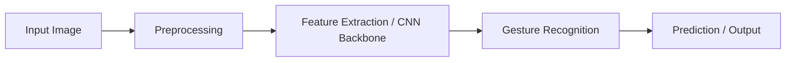

# Gesture Recognition

## 1. Title
Gesture Recognition

## 2. Definition
Gesture recognition identifies and interprets human hand or body movements as commands or communication.

## 3. What is it?
Gesture Recognition refers to gesture recognition identifies and interprets human hand or body movements as commands or communication. It sits within the broader field of Computer Vision, and
is typically encountered when building systems that need to reason, perceive, or act intelligently.

## 4. Why is it important?
Gesture Recognition matters because it provides a concrete, reusable building block for AI systems. Understanding
it allows practitioners to select the right technique for a given problem, reason about its trade-offs,
and combine it correctly with neighboring techniques such as [[Optical Character Recognition]], [[Pose Estimation]].

## 5. Core Concepts
- The core mechanism described in the Definition above
- The role this topic plays within Computer Vision
- Its inputs, outputs, and evaluation criteria
- Its relationship to neighboring techniques in this knowledge base

## 6. How It Works
Gesture Recognition operates by taking an input, applying its core mechanism, and producing an output that can be
evaluated or consumed downstream. The exact mechanics depend on the specific technique or algorithm used,
but the general pattern follows the diagram below.

## 7. Architecture / Workflow


## 8. Components
- **Input layer / data source** — the raw information the technique consumes
- **Core processing mechanism** — the algorithm, model, or architecture itself
- **Output / decision layer** — the prediction, action, or generated artifact
- **Evaluation / feedback loop** — the mechanism used to measure and improve performance

## 9. Algorithms / Techniques
Common algorithms and techniques associated with Gesture Recognition include those used across Computer Vision, most
notably the neighboring methods listed in the Related AI Topics section below.

## 10. Mathematical Concepts
This topic is primarily architectural/conceptual. Its mathematical foundations are inherited from its constituent components — see the Related AI Topics and Wikilinks sections below for the specific techniques (e.g. gradient descent, probability, or linear algebra) that underpin it.

## 11. Input
Typical input: structured or unstructured data relevant to Computer Vision (e.g. numeric features, text,
images, audio, or graph-structured data), depending on the specific application.

## 12. Processing
The processing stage applies Gesture Recognition's core mechanism (see How It Works and Architecture / Workflow)
to transform the input into an intermediate or final representation.

## 13. Output
Typical output: a prediction, classification, generated artifact, decision, or transformed representation,
depending on the task Gesture Recognition is applied to.

## 14. Real-World Examples
- Industry systems that rely on Gesture Recognition as a component of a larger pipeline
- Research prototypes demonstrating the core capability
- Open-source libraries and frameworks that implement it

## 15. Practical Applications
Gesture Recognition is applied in domains such as computer vision, and commonly intersects with adjacent fields
including Optical Character Recognition, Pose Estimation, Scene Understanding.

## 16. Advantages
- Provides a well-understood, reusable approach to its problem class
- Composable with other techniques in an AI pipeline
- Backed by established theory and/or empirical results

## 17. Limitations
- Performance depends heavily on data quality and problem framing
- May not generalize outside the assumptions it was designed under
- Can require significant compute, data, or tuning to work well in practice

## 18. Challenges
- Choosing the right variant or hyperparameters for a given task
- Evaluating performance fairly and avoiding data leakage or bias
- Integrating with production systems reliably and efficiently

## 19. Related AI Topics
- [[Optical Character Recognition]]
- [[Pose Estimation]]
- [[Scene Understanding]]
- [[Image Captioning]]
- [[Computer Vision]]
- [[Deep Learning]]
- [[Convolutional Neural Networks]]

## 20. Prerequisites
A working understanding of [[Machine Learning]] and, where relevant, [[Artificial Intelligence Fundamentals]]
is recommended before studying Gesture Recognition in depth.

## 21. Learning Path
1. Review foundational concepts in Computer Vision
2. Study the Core Concepts and How It Works sections above
3. Implement the Mini Practical Example below
4. Explore the Related AI Topics to see how Gesture Recognition connects to the wider field

## 22. Common Terminology
- **Gesture Recognition** — as defined above
- Terms shared with Computer Vision, including those introduced in linked topics

## 23. Example
A typical example of Gesture Recognition in practice follows the Architecture / Workflow diagram: input data enters
the pipeline, Gesture Recognition's mechanism is applied, and a usable output is produced for downstream consumption.

## 24. Mini Practical Example
```python
# Illustrative pseudocode for Gesture Recognition
# Real implementations vary by framework (PyTorch, TensorFlow, scikit-learn, etc.)
def apply_gesture_recognition(input_data):
    processed = preprocess(input_data)
    result = model(processed)
    return postprocess(result)
```

## 25. Comparison with Related Concepts
**Gesture Recognition** is often discussed alongside [[Optical Character Recognition]] and [[Pose Estimation]]. While related, Gesture Recognition is distinguished by its specific role described in the Definition and How It Works sections above — the related topics represent neighboring techniques, prerequisites, or complementary approaches rather than interchangeable alternatives.

## 26. AI Agent Relevance
AI agents may use Gesture Recognition as a supporting capability — for example, an agent might invoke it as a tool, use it during perception/preprocessing, or rely on it indirectly through a model it calls.

## 27. RAG / LLM Relevance
Gesture Recognition can support LLM-based systems indirectly — for instance by preprocessing data, evaluating outputs, or providing structure that an LLM-based pipeline consumes.

## 28. Important Keywords
Gesture Recognition, Computer Vision, Optical Character Recognition, Pose Estimation, Scene Understanding, Image Captioning

## 29. Related Obsidian Wikilinks
- [[Optical Character Recognition]]
- [[Pose Estimation]]
- [[Scene Understanding]]
- [[Image Captioning]]
- [[Computer Vision]]
- [[Deep Learning]]
- [[Convolutional Neural Networks]]

## 30. Summary
Gesture Recognition is a computer vision technique that gesture recognition identifies and interprets human hand or body movements as commands or communication. It connects closely to
[[Optical Character Recognition]], [[Pose Estimation]], [[Scene Understanding]] within this knowledge base,
and forms part of the broader landscape of Computer Vision covered here.

---
*Part of the [[AI-Master-Index|AI Knowledge Base]] — Category: Computer Vision*
