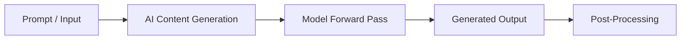

# AI Content Generation

## 1. Title
AI Content Generation

## 2. Definition
AI content generation is the broad application of generative models to automatically produce text, images, audio, or video content.

## 3. What is it?
AI Content Generation refers to aI content generation is the broad application of generative models to automatically produce text, images, audio, or video content. It sits within the broader field of Generative AI, and
is typically encountered when building systems that need to reason, perceive, or act intelligently.

## 4. Why is it important?
AI Content Generation matters because it provides a concrete, reusable building block for AI systems. Understanding
it allows practitioners to select the right technique for a given problem, reason about its trade-offs,
and combine it correctly with neighboring techniques such as [[Prompt Engineering]], [[Retrieval-Augmented Generation]].

## 5. Core Concepts
- The core mechanism described in the Definition above
- The role this topic plays within Generative AI
- Its inputs, outputs, and evaluation criteria
- Its relationship to neighboring techniques in this knowledge base

## 6. How It Works
AI Content Generation operates by taking an input, applying its core mechanism, and producing an output that can be
evaluated or consumed downstream. The exact mechanics depend on the specific technique or algorithm used,
but the general pattern follows the diagram below.

## 7. Architecture / Workflow


## 8. Components
- **Input layer / data source** — the raw information the technique consumes
- **Core processing mechanism** — the algorithm, model, or architecture itself
- **Output / decision layer** — the prediction, action, or generated artifact
- **Evaluation / feedback loop** — the mechanism used to measure and improve performance

## 9. Algorithms / Techniques
Common algorithms and techniques associated with AI Content Generation include those used across Generative AI, most
notably the neighboring methods listed in the Related AI Topics section below.

## 10. Mathematical Concepts
This topic is primarily architectural/conceptual. Its mathematical foundations are inherited from its constituent components — see the Related AI Topics and Wikilinks sections below for the specific techniques (e.g. gradient descent, probability, or linear algebra) that underpin it.

## 11. Input
Typical input: structured or unstructured data relevant to Generative AI (e.g. numeric features, text,
images, audio, or graph-structured data), depending on the specific application.

## 12. Processing
The processing stage applies AI Content Generation's core mechanism (see How It Works and Architecture / Workflow)
to transform the input into an intermediate or final representation.

## 13. Output
Typical output: a prediction, classification, generated artifact, decision, or transformed representation,
depending on the task AI Content Generation is applied to.

## 14. Real-World Examples
- Industry systems that rely on AI Content Generation as a component of a larger pipeline
- Research prototypes demonstrating the core capability
- Open-source libraries and frameworks that implement it

## 15. Practical Applications
AI Content Generation is applied in domains such as generative ai, and commonly intersects with adjacent fields
including Prompt Engineering, Retrieval-Augmented Generation, Text Generation.

## 16. Advantages
- Provides a well-understood, reusable approach to its problem class
- Composable with other techniques in an AI pipeline
- Backed by established theory and/or empirical results

## 17. Limitations
- Performance depends heavily on data quality and problem framing
- May not generalize outside the assumptions it was designed under
- Can require significant compute, data, or tuning to work well in practice

## 18. Challenges
- Choosing the right variant or hyperparameters for a given task
- Evaluating performance fairly and avoiding data leakage or bias
- Integrating with production systems reliably and efficiently

## 19. Related AI Topics
- [[Prompt Engineering]]
- [[Retrieval-Augmented Generation]]
- [[Text Generation]]
- [[Image Generation]]
- [[Generative AI]]
- [[Large Language Models]]
- [[AI Agents]]

## 20. Prerequisites
A working understanding of [[Machine Learning]] and, where relevant, [[Artificial Intelligence Fundamentals]]
is recommended before studying AI Content Generation in depth.

## 21. Learning Path
1. Review foundational concepts in Generative AI
2. Study the Core Concepts and How It Works sections above
3. Implement the Mini Practical Example below
4. Explore the Related AI Topics to see how AI Content Generation connects to the wider field

## 22. Common Terminology
- **AI Content Generation** — as defined above
- Terms shared with Generative AI, including those introduced in linked topics

## 23. Example
A typical example of AI Content Generation in practice follows the Architecture / Workflow diagram: input data enters
the pipeline, AI Content Generation's mechanism is applied, and a usable output is produced for downstream consumption.

## 24. Mini Practical Example
```python
# Illustrative pseudocode for AI Content Generation
# Real implementations vary by framework (PyTorch, TensorFlow, scikit-learn, etc.)
def apply_ai_content_generation(input_data):
    processed = preprocess(input_data)
    result = model(processed)
    return postprocess(result)
```

## 25. Comparison with Related Concepts
**AI Content Generation** is often discussed alongside [[Prompt Engineering]] and [[Retrieval-Augmented Generation]]. While related, AI Content Generation is distinguished by its specific role described in the Definition and How It Works sections above — the related topics represent neighboring techniques, prerequisites, or complementary approaches rather than interchangeable alternatives.

## 26. AI Agent Relevance
AI agents may use AI Content Generation as a supporting capability — for example, an agent might invoke it as a tool, use it during perception/preprocessing, or rely on it indirectly through a model it calls.

## 27. RAG / LLM Relevance
This is a core building block of modern Retrieval-Augmented Generation and LLM systems.

## 28. Important Keywords
AI Content Generation, Generative AI, Prompt Engineering, Retrieval-Augmented Generation, Text Generation, Image Generation

## 29. Related Obsidian Wikilinks
- [[Prompt Engineering]]
- [[Retrieval-Augmented Generation]]
- [[Text Generation]]
- [[Image Generation]]
- [[Generative AI]]
- [[Large Language Models]]
- [[AI Agents]]

## 30. Summary
AI Content Generation is a generative ai technique that aI content generation is the broad application of generative models to automatically produce text, images, audio, or video content. It connects closely to
[[Prompt Engineering]], [[Retrieval-Augmented Generation]], [[Text Generation]] within this knowledge base,
and forms part of the broader landscape of Generative AI covered here.

---
*Part of the [[AI-Master-Index|AI Knowledge Base]] — Category: Generative AI*
