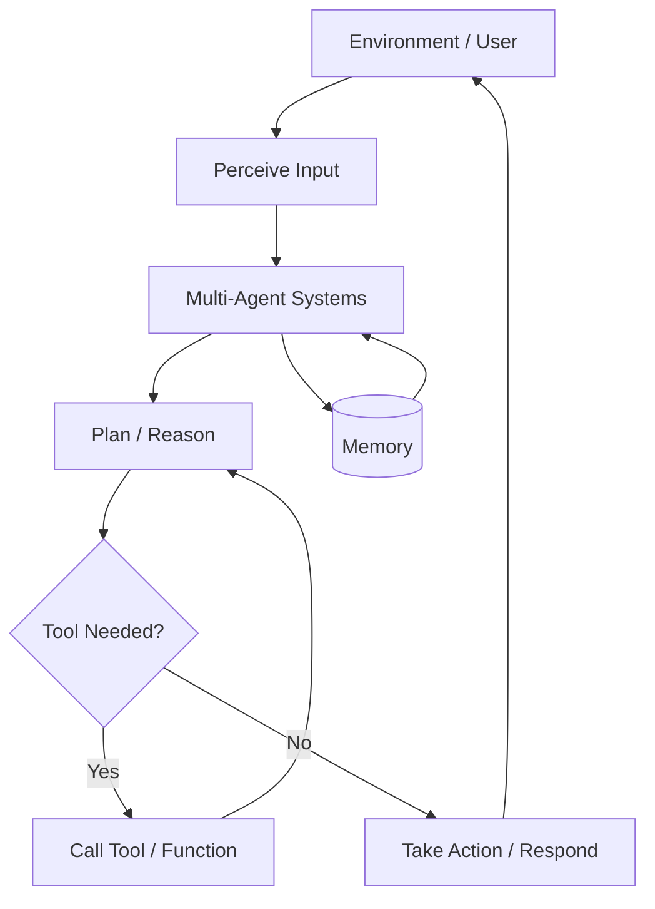

# Multi-Agent Systems

## 1. Title
Multi-Agent Systems

## 2. Definition
Multi-Agent Systems consist of multiple interacting AI agents that coordinate, cooperate, or compete to solve tasks collectively.

## 3. What is it?
Multi-Agent Systems refers to multi-Agent Systems consist of multiple interacting AI agents that coordinate, cooperate, or compete to solve tasks collectively. It sits within the broader field of AI Agents, and
is typically encountered when building systems that need to reason, perceive, or act intelligently.

## 4. Why is it important?
Multi-Agent Systems matters because it provides a concrete, reusable building block for AI systems. Understanding
it allows practitioners to select the right technique for a given problem, reason about its trade-offs,
and combine it correctly with neighboring techniques such as [[Agentic AI]], [[Autonomous AI]].

## 5. Core Concepts
- The core mechanism described in the Definition above
- The role this topic plays within AI Agents
- Its inputs, outputs, and evaluation criteria
- Its relationship to neighboring techniques in this knowledge base

## 6. How It Works
Multi-Agent Systems operates by taking an input, applying its core mechanism, and producing an output that can be
evaluated or consumed downstream. The exact mechanics depend on the specific technique or algorithm used,
but the general pattern follows the diagram below.

## 7. Architecture / Workflow


## 8. Components
- **Input layer / data source** — the raw information the technique consumes
- **Core processing mechanism** — the algorithm, model, or architecture itself
- **Output / decision layer** — the prediction, action, or generated artifact
- **Evaluation / feedback loop** — the mechanism used to measure and improve performance

## 9. Algorithms / Techniques
Common algorithms and techniques associated with Multi-Agent Systems include those used across AI Agents, most
notably the neighboring methods listed in the Related AI Topics section below.

## 10. Mathematical Concepts
This topic is primarily architectural/conceptual. Its mathematical foundations are inherited from its constituent components — see the Related AI Topics and Wikilinks sections below for the specific techniques (e.g. gradient descent, probability, or linear algebra) that underpin it.

## 11. Input
Typical input: structured or unstructured data relevant to AI Agents (e.g. numeric features, text,
images, audio, or graph-structured data), depending on the specific application.

## 12. Processing
The processing stage applies Multi-Agent Systems's core mechanism (see How It Works and Architecture / Workflow)
to transform the input into an intermediate or final representation.

## 13. Output
Typical output: a prediction, classification, generated artifact, decision, or transformed representation,
depending on the task Multi-Agent Systems is applied to.

## 14. Real-World Examples
- Industry systems that rely on Multi-Agent Systems as a component of a larger pipeline
- Research prototypes demonstrating the core capability
- Open-source libraries and frameworks that implement it

## 15. Practical Applications
Multi-Agent Systems is applied in domains such as ai agents, and commonly intersects with adjacent fields
including Agentic AI, Autonomous AI, AI Agent Planning.

## 16. Advantages
- Provides a well-understood, reusable approach to its problem class
- Composable with other techniques in an AI pipeline
- Backed by established theory and/or empirical results

## 17. Limitations
- Performance depends heavily on data quality and problem framing
- May not generalize outside the assumptions it was designed under
- Can require significant compute, data, or tuning to work well in practice

## 18. Challenges
- Choosing the right variant or hyperparameters for a given task
- Evaluating performance fairly and avoiding data leakage or bias
- Integrating with production systems reliably and efficiently

## 19. Related AI Topics
- [[Agentic AI]]
- [[Autonomous AI]]
- [[AI Agent Planning]]
- [[Tool-Using AI]]
- [[AI Agents]]
- [[Large Language Models]]
- [[Reasoning AI]]

## 20. Prerequisites
A working understanding of [[Machine Learning]] and, where relevant, [[Artificial Intelligence Fundamentals]]
is recommended before studying Multi-Agent Systems in depth.

## 21. Learning Path
1. Review foundational concepts in AI Agents
2. Study the Core Concepts and How It Works sections above
3. Implement the Mini Practical Example below
4. Explore the Related AI Topics to see how Multi-Agent Systems connects to the wider field

## 22. Common Terminology
- **Multi-Agent Systems** — as defined above
- Terms shared with AI Agents, including those introduced in linked topics

## 23. Example
A typical example of Multi-Agent Systems in practice follows the Architecture / Workflow diagram: input data enters
the pipeline, Multi-Agent Systems's mechanism is applied, and a usable output is produced for downstream consumption.

## 24. Mini Practical Example
```python
# Illustrative pseudocode for Multi-Agent Systems
# Real implementations vary by framework (PyTorch, TensorFlow, scikit-learn, etc.)
def apply_multi_agent_systems(input_data):
    processed = preprocess(input_data)
    result = model(processed)
    return postprocess(result)
```

## 25. Comparison with Related Concepts
**Multi-Agent Systems** is often discussed alongside [[Agentic AI]] and [[Autonomous AI]]. While related, Multi-Agent Systems is distinguished by its specific role described in the Definition and How It Works sections above — the related topics represent neighboring techniques, prerequisites, or complementary approaches rather than interchangeable alternatives.

## 26. AI Agent Relevance
Modern AI agents rely directly on this capability as part of their reasoning or execution loop.

## 27. RAG / LLM Relevance
This is a core building block of modern Retrieval-Augmented Generation and LLM systems.

## 28. Important Keywords
Multi-Agent Systems, AI Agents, Agentic AI, Autonomous AI, AI Agent Planning, Tool-Using AI

## 29. Related Obsidian Wikilinks
- [[Agentic AI]]
- [[Autonomous AI]]
- [[AI Agent Planning]]
- [[Tool-Using AI]]
- [[AI Agents]]
- [[Large Language Models]]
- [[Reasoning AI]]

## 30. Summary
Multi-Agent Systems is a ai agents technique that multi-Agent Systems consist of multiple interacting AI agents that coordinate, cooperate, or compete to solve tasks collectively. It connects closely to
[[Agentic AI]], [[Autonomous AI]], [[AI Agent Planning]] within this knowledge base,
and forms part of the broader landscape of AI Agents covered here.

---
*Part of the [[AI-Master-Index|AI Knowledge Base]] — Category: AI Agents*
