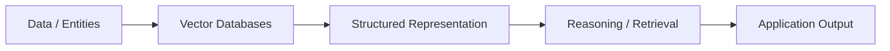

# Vector Databases

## 1. Title
Vector Databases

## 2. Definition
Vector databases store and index high-dimensional embeddings, enabling fast similarity search for retrieval-based AI applications.

## 3. What is it?
Vector Databases refers to vector databases store and index high-dimensional embeddings, enabling fast similarity search for retrieval-based AI applications. It sits within the broader field of Advanced AI, and
is typically encountered when building systems that need to reason, perceive, or act intelligently.

## 4. Why is it important?
Vector Databases matters because it provides a concrete, reusable building block for AI systems. Understanding
it allows practitioners to select the right technique for a given problem, reason about its trade-offs,
and combine it correctly with neighboring techniques such as [[Graph AI]], [[Vector Embeddings]].

## 5. Core Concepts
- The core mechanism described in the Definition above
- The role this topic plays within Advanced AI
- Its inputs, outputs, and evaluation criteria
- Its relationship to neighboring techniques in this knowledge base

## 6. How It Works
Vector Databases operates by taking an input, applying its core mechanism, and producing an output that can be
evaluated or consumed downstream. The exact mechanics depend on the specific technique or algorithm used,
but the general pattern follows the diagram below.

## 7. Architecture / Workflow


## 8. Components
- **Input layer / data source** — the raw information the technique consumes
- **Core processing mechanism** — the algorithm, model, or architecture itself
- **Output / decision layer** — the prediction, action, or generated artifact
- **Evaluation / feedback loop** — the mechanism used to measure and improve performance

## 9. Algorithms / Techniques
Common algorithms and techniques associated with Vector Databases include those used across Advanced AI, most
notably the neighboring methods listed in the Related AI Topics section below.

## 10. Mathematical Concepts
This topic is primarily architectural/conceptual. Its mathematical foundations are inherited from its constituent components — see the Related AI Topics and Wikilinks sections below for the specific techniques (e.g. gradient descent, probability, or linear algebra) that underpin it.

## 11. Input
Typical input: structured or unstructured data relevant to Advanced AI (e.g. numeric features, text,
images, audio, or graph-structured data), depending on the specific application.

## 12. Processing
The processing stage applies Vector Databases's core mechanism (see How It Works and Architecture / Workflow)
to transform the input into an intermediate or final representation.

## 13. Output
Typical output: a prediction, classification, generated artifact, decision, or transformed representation,
depending on the task Vector Databases is applied to.

## 14. Real-World Examples
- Industry systems that rely on Vector Databases as a component of a larger pipeline
- Research prototypes demonstrating the core capability
- Open-source libraries and frameworks that implement it

## 15. Practical Applications
Vector Databases is applied in domains such as advanced ai, and commonly intersects with adjacent fields
including Graph AI, Vector Embeddings, Semantic Retrieval.

## 16. Advantages
- Provides a well-understood, reusable approach to its problem class
- Composable with other techniques in an AI pipeline
- Backed by established theory and/or empirical results

## 17. Limitations
- Performance depends heavily on data quality and problem framing
- May not generalize outside the assumptions it was designed under
- Can require significant compute, data, or tuning to work well in practice

## 18. Challenges
- Choosing the right variant or hyperparameters for a given task
- Evaluating performance fairly and avoiding data leakage or bias
- Integrating with production systems reliably and efficiently

## 19. Related AI Topics
- [[Graph AI]]
- [[Vector Embeddings]]
- [[Semantic Retrieval]]
- [[Bayesian Networks]]
- [[Knowledge Graphs]]
- [[Machine Learning]]

## 20. Prerequisites
A working understanding of [[Machine Learning]] and, where relevant, [[Artificial Intelligence Fundamentals]]
is recommended before studying Vector Databases in depth.

## 21. Learning Path
1. Review foundational concepts in Advanced AI
2. Study the Core Concepts and How It Works sections above
3. Implement the Mini Practical Example below
4. Explore the Related AI Topics to see how Vector Databases connects to the wider field

## 22. Common Terminology
- **Vector Databases** — as defined above
- Terms shared with Advanced AI, including those introduced in linked topics

## 23. Example
A typical example of Vector Databases in practice follows the Architecture / Workflow diagram: input data enters
the pipeline, Vector Databases's mechanism is applied, and a usable output is produced for downstream consumption.

## 24. Mini Practical Example
```python
# Illustrative pseudocode for Vector Databases
# Real implementations vary by framework (PyTorch, TensorFlow, scikit-learn, etc.)
def apply_vector_databases(input_data):
    processed = preprocess(input_data)
    result = model(processed)
    return postprocess(result)
```

## 25. Comparison with Related Concepts
**Vector Databases** is often discussed alongside [[Graph AI]] and [[Vector Embeddings]]. While related, Vector Databases is distinguished by its specific role described in the Definition and How It Works sections above — the related topics represent neighboring techniques, prerequisites, or complementary approaches rather than interchangeable alternatives.

## 26. AI Agent Relevance
AI agents may use Vector Databases as a supporting capability — for example, an agent might invoke it as a tool, use it during perception/preprocessing, or rely on it indirectly through a model it calls.

## 27. RAG / LLM Relevance
This is a core building block of modern Retrieval-Augmented Generation and LLM systems.

## 28. Important Keywords
Vector Databases, Advanced AI, Graph AI, Vector Embeddings, Semantic Retrieval, Bayesian Networks

## 29. Related Obsidian Wikilinks
- [[Graph AI]]
- [[Vector Embeddings]]
- [[Semantic Retrieval]]
- [[Bayesian Networks]]
- [[Knowledge Graphs]]
- [[Machine Learning]]

## 30. Summary
Vector Databases is a advanced ai technique that vector databases store and index high-dimensional embeddings, enabling fast similarity search for retrieval-based AI applications. It connects closely to
[[Graph AI]], [[Vector Embeddings]], [[Semantic Retrieval]] within this knowledge base,
and forms part of the broader landscape of Advanced AI covered here.

---
*Part of the [[AI-Master-Index|AI Knowledge Base]] — Category: Advanced AI*
