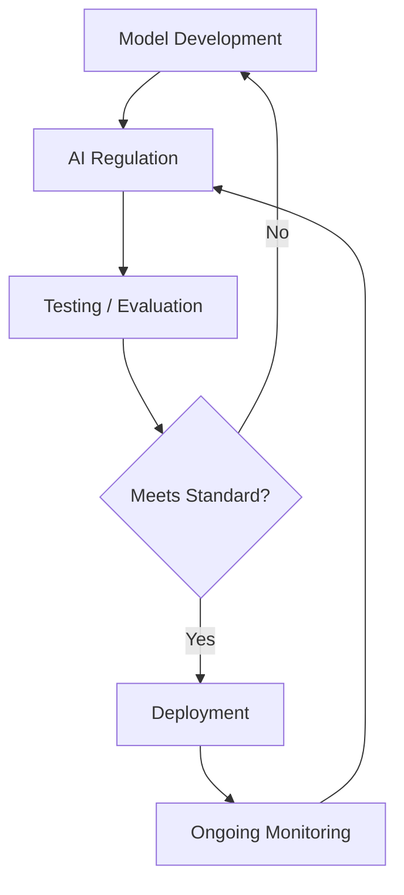

# AI Regulation

## 1. Title
AI Regulation

## 2. Definition
AI regulation refers to laws and rules enacted by governments to control how AI systems are developed, deployed, and used.

## 3. What is it?
AI Regulation refers to aI regulation refers to laws and rules enacted by governments to control how AI systems are developed, deployed, and used. It sits within the broader field of AI Safety & Ethics, and
is typically encountered when building systems that need to reason, perceive, or act intelligently.

## 4. Why is it important?
AI Regulation matters because it provides a concrete, reusable building block for AI systems. Understanding
it allows practitioners to select the right technique for a given problem, reason about its trade-offs,
and combine it correctly with neighboring techniques such as [[AI Alignment]], [[AI Governance]].

## 5. Core Concepts
- The core mechanism described in the Definition above
- The role this topic plays within AI Safety & Ethics
- Its inputs, outputs, and evaluation criteria
- Its relationship to neighboring techniques in this knowledge base

## 6. How It Works
AI Regulation operates by taking an input, applying its core mechanism, and producing an output that can be
evaluated or consumed downstream. The exact mechanics depend on the specific technique or algorithm used,
but the general pattern follows the diagram below.

## 7. Architecture / Workflow

## 8. Components
- **Input layer / data source** — the raw information the technique consumes
- **Core processing mechanism** — the algorithm, model, or architecture itself
- **Output / decision layer** — the prediction, action, or generated artifact
- **Evaluation / feedback loop** — the mechanism used to measure and improve performance

## 9. Algorithms / Techniques
Common algorithms and techniques associated with AI Regulation include those used across AI Safety & Ethics, most
notably the neighboring methods listed in the Related AI Topics section below.

## 10. Mathematical Concepts
This topic is primarily architectural/conceptual. Its mathematical foundations are inherited from its constituent components — see the Related AI Topics and Wikilinks sections below for the specific techniques (e.g. gradient descent, probability, or linear algebra) that underpin it.

## 11. Input
Typical input: structured or unstructured data relevant to AI Safety & Ethics (e.g. numeric features, text,
images, audio, or graph-structured data), depending on the specific application.

## 12. Processing
The processing stage applies AI Regulation's core mechanism (see How It Works and Architecture / Workflow)
to transform the input into an intermediate or final representation.

## 13. Output
Typical output: a prediction, classification, generated artifact, decision, or transformed representation,
depending on the task AI Regulation is applied to.

## 14. Real-World Examples
- Industry systems that rely on AI Regulation as a component of a larger pipeline
- Research prototypes demonstrating the core capability
- Open-source libraries and frameworks that implement it

## 15. Practical Applications
AI Regulation is applied in domains such as ai safety & ethics, and commonly intersects with adjacent fields
including AI Alignment, AI Governance, AI Auditing.

## 16. Advantages
- Provides a well-understood, reusable approach to its problem class
- Composable with other techniques in an AI pipeline
- Backed by established theory and/or empirical results

## 17. Limitations
- Performance depends heavily on data quality and problem framing
- May not generalize outside the assumptions it was designed under
- Can require significant compute, data, or tuning to work well in practice

## 18. Challenges
- Choosing the right variant or hyperparameters for a given task
- Evaluating performance fairly and avoiding data leakage or bias
- Integrating with production systems reliably and efficiently

## 19. Related AI Topics
- [[AI Alignment]]
- [[AI Governance]]
- [[AI Auditing]]
- [[AI Evaluation]]
- [[Responsible AI]]

## 20. Prerequisites
A working understanding of [[Machine Learning]] and, where relevant, [[Artificial Intelligence Fundamentals]]
is recommended before studying AI Regulation in depth.

## 21. Learning Path
1. Review foundational concepts in AI Safety & Ethics
2. Study the Core Concepts and How It Works sections above
3. Implement the Mini Practical Example below
4. Explore the Related AI Topics to see how AI Regulation connects to the wider field

## 22. Common Terminology
- **AI Regulation** — as defined above
- Terms shared with AI Safety & Ethics, including those introduced in linked topics

## 23. Example
A typical example of AI Regulation in practice follows the Architecture / Workflow diagram: input data enters
the pipeline, AI Regulation's mechanism is applied, and a usable output is produced for downstream consumption.

## 24. Mini Practical Example
This is a governance/process topic rather than an implementation technique, so no standalone code example applies. In practice it is applied through checklists, evaluation harnesses, and organizational review processes.

## 25. Comparison with Related Concepts
**AI Regulation** is often discussed alongside [[AI Alignment]] and [[AI Governance]]. While related, AI Regulation is distinguished by its specific role described in the Definition and How It Works sections above — the related topics represent neighboring techniques, prerequisites, or complementary approaches rather than interchangeable alternatives.

## 26. AI Agent Relevance
AI agents may use AI Regulation as a supporting capability — for example, an agent might invoke it as a tool, use it during perception/preprocessing, or rely on it indirectly through a model it calls.

## 27. RAG / LLM Relevance
AI Regulation can support LLM-based systems indirectly — for instance by preprocessing data, evaluating outputs, or providing structure that an LLM-based pipeline consumes.

## 28. Important Keywords
AI Regulation, AI Safety & Ethics, AI Alignment, AI Governance, AI Auditing, AI Evaluation

## 29. Related Obsidian Wikilinks
- [[AI Alignment]]
- [[AI Governance]]
- [[AI Auditing]]
- [[AI Evaluation]]
- [[Responsible AI]]

## 30. Summary
AI Regulation is a ai safety & ethics technique that aI regulation refers to laws and rules enacted by governments to control how AI systems are developed, deployed, and used. It connects closely to
[[AI Alignment]], [[AI Governance]], [[AI Auditing]] within this knowledge base,
and forms part of the broader landscape of AI Safety & Ethics covered here.

---
*Part of the [[AI-Master-Index|AI Knowledge Base]] — Category: AI Safety & Ethics*
