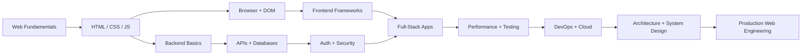

# Web Development Index

This is the entry point to the knowledge base. Web Development is organized here into nine domains, each with its own sub-index. Start with [[Web Fundamentals]] if you are new, or jump directly to a domain below.

## Domains

- [[Frontend-Index|Frontend]] — HTML, CSS, JavaScript, TypeScript, browser, DOM, frameworks, UI engineering
- [[Backend-Index|Backend]] — server architecture, Node.js, backend frameworks, APIs, real-time systems
- [[Database-Index|Databases]] — SQL, NoSQL, ORMs, data modeling, caching of data
- [[Security-Index|Security]] — authentication, authorization, OWASP Top 10, secure coding
- [[Performance-Index|Performance]] — Core Web Vitals, frontend/backend performance, caching strategy
- [[DevOps-Index|DevOps]] — CI/CD, Docker, deployment, cloud, serverless, monitoring
- [[Architecture-Index|Architecture]] — application architecture patterns, microservices, message queues
- [[System-Design-Index|System Design]] — designing large-scale web systems end to end

## Learning Progression

Beginner → Intermediate: [[Web Fundamentals]], [[HTML]], [[CSS]], [[JavaScript]]

Intermediate → Advanced: frontend frameworks, backend frameworks, databases, authentication, testing

Advanced → Professional: security, performance, DevOps, cloud, real-time systems

Professional → Expert: architecture, system design, microservices, scalability, production engineering

## Related Topics

- [[Web-Development-Roadmap|Web Development Roadmap]]
- [[Web-Development-Glossary|Glossary]]
