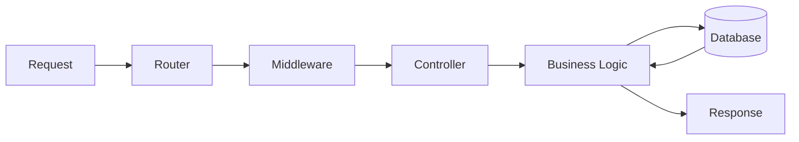

# Backend

## Definition
The backend is the server-side portion of a web application: business logic, data storage, authentication/authorization, and APIs that the frontend (or other clients) consume.

## Why It Matters
The backend is the trusted part of the system. It enforces the rules that must not be bypassable — pricing, permissions, data integrity — because it runs on infrastructure the operator controls, not the end user's device.

## Core Concepts
- **Server / runtime** — e.g. [[Node.js]], Python, Java.
- **Framework** — routing, middleware ([[Backend Frameworks]]).
- **Data layer** — [[Databases]], [[ORM-and-Data-Access|ORMs]].
- **API surface** — [[REST]], [[GraphQL]], [[Real-Time Web|WebSockets]].

## How It Works
The backend receives an HTTP request, routes it to a handler, runs middleware (auth, validation, logging), executes business logic (often touching a database), and returns a response — typically JSON for an API, or rendered HTML for server-rendered pages.

## Mermaid Diagram

## Real-World Usage
A typical backend: Node.js + Express (or NestJS) exposing a REST or GraphQL API, backed by PostgreSQL via an ORM like Prisma, with JWT-based auth and rate limiting.

## Advantages
- Full control over environment, language, and infrastructure.
- Central place to enforce security and business rules.

## Disadvantages
- You own uptime, scaling, and security of infrastructure you run.
- Slower feedback loop than frontend-only changes (deploys, migrations).

## Common Mistakes
- Trusting client input without server-side validation.
- Leaking internal error details (stack traces) to clients.

## Best Practices
- Validate and sanitize all input at the boundary.
- Keep business logic out of route handlers — isolate it in a service layer for testability.

## Security Considerations
The backend is the last line of defense; every authorization and validation rule must be enforced here regardless of what the frontend does.

## Related Topics
- [[Frontend]]
- [[Full Stack]]
- [[Backend Engineering]]
- [[API Development]]

## Prerequisites
- [[What Is Web Development]]
- [[Client Server Architecture]]

## Quick Revision
Backend = trusted server-side code: business logic, data, auth, APIs. Never trust the frontend to enforce rules.

## Interview Questions
- Why is server-side validation required even when client-side validation exists?
- What is the role of a service layer in backend architecture?
