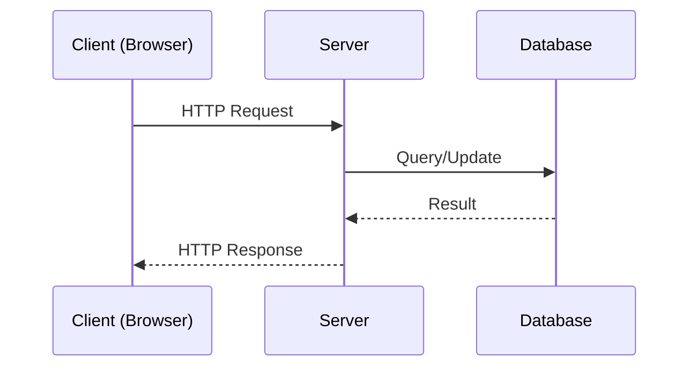

# Client Server Architecture

## Definition
Client-server architecture is a model where a **client** (browser, mobile app) initiates requests, and a **server** listens for and responds to those requests, typically over HTTP.

## Why It Matters
Almost all web systems are built on this model. Understanding which side (client or server) owns which responsibility is the basis for reasoning about performance, security, and state.

## Core Concepts
- **Client** — initiates requests, renders responses, owns UI state.
- **Server** — holds business logic and data, enforces authorization, responds to requests.
- **Stateless communication** — each HTTP request is independent; the server does not (by default) remember prior requests.

## How It Works
The client sends a request (method, URL, headers, optional body). The server processes it — reading/writing a database, applying business rules — and returns a response (status code, headers, body). The client then updates what the user sees.

## Mermaid Diagram

## Real-World Usage
A React frontend calling a REST API built with Node.js/Express, backed by PostgreSQL, is a classic client-server system. Mobile apps calling the same API are just another client.

## Advantages
- Clear separation of concerns; client and server can be built/scaled independently.
- Multiple client types (web, mobile, CLI) can share one backend.

## Disadvantages
- Network latency between client and server.
- Requires explicit handling of state, auth, and synchronization across requests.

## Common Mistakes
- Putting business logic or secrets in client-side code, where it is fully visible to the user.
- Assuming the client can be trusted — all authorization must be enforced server-side.

## Best Practices
- Treat every request as coming from an untrusted client and validate/authorize on the server.
- Keep the API contract stable and versioned independently of UI changes.

## Security Considerations
Never trust client-supplied data or client-side-only checks; re-validate and re-authorize on the server for every request.

## Related Topics
- [[Request Response Model]]
- [[Frontend]]
- [[Backend]]
- [[HTTP]]

## Prerequisites
- [[What Is Web Development]]

## Quick Revision
Client initiates, server responds; server is the source of truth and must never trust the client.

## Interview Questions
- Why should authorization checks never live only on the client?
- What does it mean for HTTP to be "stateless," and how do sessions/cookies work around that?
