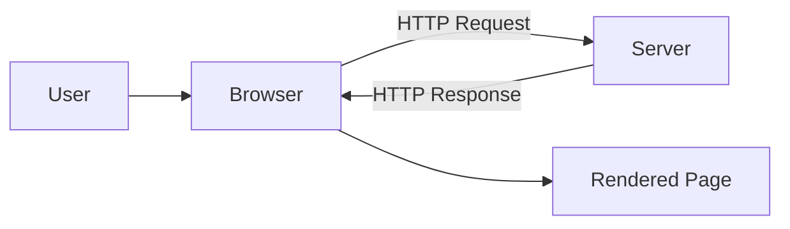

# What Is Web Development

## Definition
Web Development is the work of building and maintaining websites and web applications — everything that runs in a browser and is delivered over HTTP, from a single static page to a distributed, multi-service platform.

## Why It Matters
Nearly every business, product, and service now has a web presence or a web-delivered product. Web Development sits at the intersection of design, engineering, networking, and operations, and is one of the largest and most in-demand fields in software.

## Core Concepts
- **Frontend** — what runs in the user's browser (HTML, CSS, JavaScript).
- **Backend** — server-side logic, APIs, and data storage.
- **Full Stack** — working across both frontend and backend.
- **The Web Platform** — the standardized set of technologies (HTTP, HTML, CSS, JS, DOM) that browsers implement.

## How It Works
A user's browser sends an HTTP request to a server (directly, or via a CDN/load balancer). The server — or a static file host — returns HTML, CSS, and JavaScript, which the browser parses and renders. Dynamic applications also exchange data with APIs and databases after the initial page loads.

## Mermaid Diagram

## Real-World Usage
Professional web development spans marketing sites, SaaS products, e-commerce, internal tools, and public APIs, built by specialized roles (frontend engineer, backend engineer, full-stack engineer, DevOps/platform engineer).

## Advantages
- Cross-platform by default (any device with a browser).
- No install required; instantly updatable.
- Enormous ecosystem of tools, frameworks, and hosting options.

## Disadvantages
- Browser inconsistencies and constraints.
- Network dependency (latency, offline behavior).
- Security surface is large (client-facing by definition).

## Common Mistakes
- Treating frontend and backend as unrelated instead of one system.
- Ignoring performance, accessibility, and security until late in a project.

## Best Practices
- Learn the underlying web platform (HTTP, HTML, CSS, JS) before frameworks.
- Understand the full request/response lifecycle, not just UI code.

## Related Topics
- [[Frontend]]
- [[Backend]]
- [[Full Stack]]
- [[Client Server Architecture]]
- [[Web Application]]

## Prerequisites
None — this is the starting point of the knowledge base.

## Quick Revision
Web Development = building things that run in browsers over HTTP; splits into frontend (client), backend (server), and full-stack (both).

## Interview Questions
- What is the difference between a website and a web application?
- What is the difference between frontend and backend development?
- Describe the request/response cycle in your own words.
