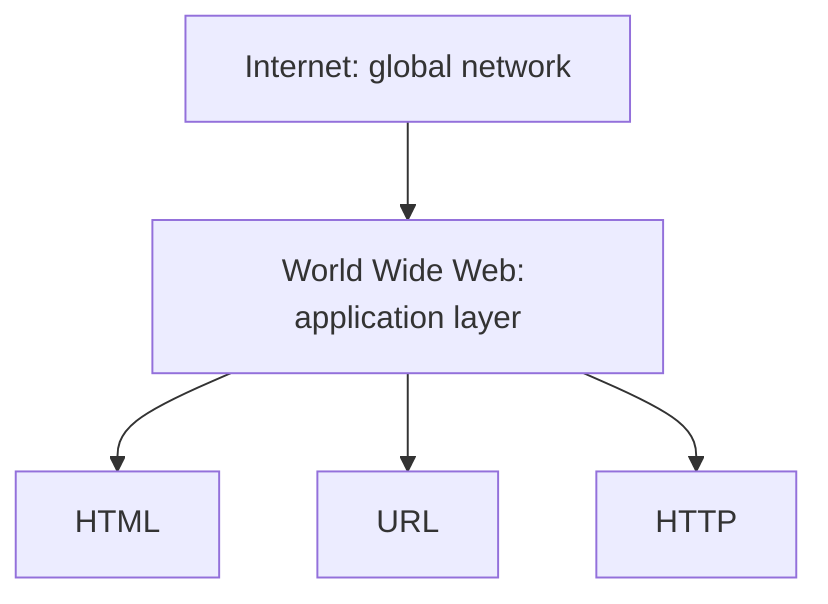

# World Wide Web

## Definition
The World Wide Web (WWW, "the Web") is a system of interlinked hypertext documents and applications accessed via the Internet, using URLs to identify resources and HTTP to transfer them.

## Why It Matters
The Web is the application layer most people mean when they say "the internet." Understanding that the Web is *built on top of* the Internet — not the same thing — is foundational to understanding how requests actually travel.

## Core Concepts
- **Hypertext** — documents linked to each other via hyperlinks.
- **URL** — the address of a resource on the Web.
- **HTTP** — the protocol used to transfer Web resources.
- **Browser** — the client application that renders Web resources.

## How It Works
Invented by Tim Berners-Lee in 1989 at CERN, the Web combined three ideas: HTML (a document format), URLs (a naming scheme), and HTTP (a transfer protocol). A browser resolves a URL, sends an HTTP request, receives an HTML response, and renders it — following hyperlinks to other documents on request.

## Mermaid Diagram

## Real-World Usage
Every website, web app, and public API is part of the Web. Search engines crawl the Web's hyperlink graph to index content.

## Advantages
- Open, decentralized, and based on public standards (W3C, WHATWG).
- Any device with a compliant browser can access any public Web resource.

## Common Mistakes
- Using "Internet" and "Web" interchangeably in technical contexts.

## Best Practices
- Distinguish network-layer concerns (Internet, [[Internet Fundamentals|TCP/IP]]) from application-layer concerns (Web, HTTP, HTML).

## Related Topics
- [[Internet vs Web]]
- [[HTTP]]
- [[URL]]
- [[Web Standards]]

## Prerequisites
- [[What Is Web Development]]

## Quick Revision
The Web = hypertext documents + URLs + HTTP, running on top of the Internet.

## Interview Questions
- Who invented the World Wide Web, and what three technologies did it combine?
- Is email part of the World Wide Web? Why or why not?
