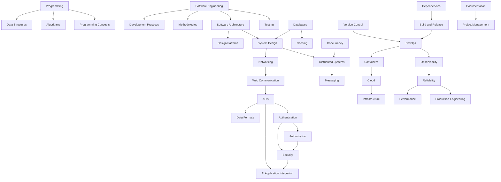

# Knowledge Graph

A high-level Mermaid map connecting the major categories in this knowledge base. For topic-level
relationships, see each topic's "Related Topics" section.

## Category Summary

| Category | Hub Topic | Feeds Into |
|----------|-----------|------------|
| Programming Fundamentals | [[Programming]] | Programming Concepts, Data Structures, Algorithms |
| Software Engineering | [[Software Engineering]] | Development Practices, Methodologies, Architecture |
| Architecture & System Design | [[Software Architecture]] | Design Patterns, System Design, Distributed Systems |
| Networking & Web | [[Computer Networking]] | Web Communication, APIs, Data Formats |
| Databases & Caching | [[Database Fundamentals]] | Caching, Performance, System Design |
| Security | [[Application Security]] | Authentication, Authorization |
| DevOps & Infrastructure | [[DevOps]] | Containers, Cloud, Infrastructure, Observability |
| Reliability & Production | [[Reliability and Resilience]] | Performance, Production Engineering |
| AI Integration | [[AI API Integration]] | Prompt Engineering, RAG, Vector Databases |
