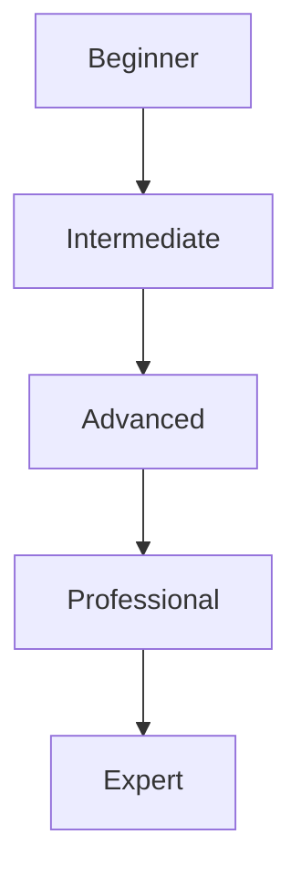

# Recommended Learning Path

Suggested progression through this knowledge base, from foundational to expert-level topics.
Within each level, topics are grouped by category rather than a strict linear order — pick the
category relevant to what you are building.

## Beginner (51 topics)

**Programming:** [[Programming]], [[Variables and Data Types]], [[Operators and Expressions]], [[Conditional Logic and Loops]], [[Functions]], [[Modules and Packages]]
**Programming Concepts:** [[Object-Oriented Programming]]
**Data Structures:** [[Data Structures Overview]], [[Arrays and Strings]], [[Linked Lists]], [[Stacks and Queues]], [[Sets and Maps]]
**Algorithms:** [[Algorithms Overview]], [[Searching Algorithms]], [[Sorting Algorithms]]
**Software Engineering:** [[Software Engineering]], [[Software Development Life Cycle (SDLC)]], [[Code Review]]
**Development Practices:** [[DRY, KISS, and YAGNI]]
**Methodologies:** [[Agile]], [[Scrum]], [[Kanban]], [[Waterfall]], [[Sprint Planning and Backlog]], [[User Stories and Estimation]]
**Architecture:** [[Client-Server Architecture]]
**Networking:** [[Computer Networking]], [[Bandwidth and Network Latency]]
**Web Communication:** [[HTTP]], [[HTTP Methods]], [[HTTP Headers and Status Codes]]
**Data Formats:** [[Data Serialization Formats]], [[JSON]]
**Databases:** [[Database Fundamentals]], [[Relational Databases and SQL]], [[Keys and Relationships]], [[CRUD and Queries]]
**Testing:** [[Software Testing]], [[Unit Testing]], [[Smoke and Sanity Testing]]
**Debugging:** [[Debugging]], [[Logging]], [[Stack Traces]]
**Version Control:** [[Version Control]], [[Git]], [[Pull Requests]]
**Dependencies:** [[Package Managers]]
**Documentation:** [[Technical Documentation]], [[README Files]], [[Changelogs]]
**Project Management:** [[Issue Tracking]]

## Intermediate (114 topics)

**Programming:** [[Scope and Closures]], [[Recursion]], [[Error Handling and Exceptions]], [[Serialization and Deserialization]]
**Programming Concepts:** [[Abstraction and Encapsulation]], [[Inheritance and Polymorphism]], [[Interfaces and Composition]], [[Separation of Concerns]], [[Coupling and Cohesion]], [[Immutability and State Management]], [[Pure Functions and Side Effects]], [[Functional Programming]], [[Event-Driven Programming]]
**Data Structures:** [[Hash Tables]], [[Trees]], [[Heaps and Priority Queues]], [[Graphs]]
**Algorithms:** [[Divide and Conquer]], [[Greedy Algorithms]], [[Hashing]], [[Complexity Analysis (Big O)]]
**Software Engineering:** [[Requirements Engineering]], [[Software Design]], [[Release Management and Versioning]], [[Technical Debt]], [[Refactoring]], [[Software Maintenance]]
**Development Practices:** [[Clean Code]], [[Code Smells]], [[Static Analysis and Linting]], [[Code Organization and Modularity]]
**Methodologies:** [[Extreme Programming and Lean]]
**Design Patterns:** [[Design Patterns Overview]], [[Factory Pattern]], [[Builder Pattern]], [[Singleton Pattern]], [[Adapter Pattern]], [[Decorator Pattern]], [[Facade and Proxy Patterns]], [[Observer Pattern]], [[Strategy Pattern]]
**Architecture:** [[Layered Architecture]], [[Monolithic Architecture]], [[MVC and MVVM]]
**System Design:** [[Latency and Throughput]], [[Load Balancing]], [[Horizontal and Vertical Scaling]], [[Capacity Planning]]
**Networking:** [[OSI and TCP/IP Models]], [[IP Addressing]], [[TCP and UDP]], [[Ports and Sockets]], [[DNS]], [[NAT and Routing]], [[Firewalls]], [[Proxy and Reverse Proxy]]
**Web Communication:** [[HTTPS and TLS]], [[Cookies and Sessions]], [[WebSocket]], [[Server-Sent Events and Webhooks]], [[HTTP Caching]], [[HTTP Compression]]
**APIs:** [[API Design]], [[REST API]], [[API Versioning]], [[API Documentation]], [[Pagination, Filtering, and Sorting]], [[API Testing]]
**Data Formats:** [[XML and YAML]], [[Schema Validation and Character Encoding]]
**Databases:** [[NoSQL Databases]], [[Database Schema Design]], [[Joins]], [[Indexes]], [[Transactions]], [[Database Migrations]]
**Caching:** [[Caching Fundamentals]]
**Concurrency:** [[Processes and Threads]], [[Promises and Futures]]
**Authentication:** [[Authentication]], [[Multi-Factor Authentication]]
**Authorization:** [[Authorization]], [[Principle of Least Privilege]]
**Security:** [[Input Validation and Output Encoding]], [[CORS]]
**Testing:** [[Integration Testing]], [[Regression Testing]], [[Mocking and Test Doubles]], [[Test Coverage]]
**Version Control:** [[Branching Strategies]], [[Merge and Rebase]], [[Semantic Versioning]]
**Dependencies:** [[Dependency Management]], [[Lock Files]]
**Build and Release:** [[Build Systems]], [[Compilation and Transpilation]], [[Bundling and Minification]]
**DevOps:** [[Continuous Integration]], [[Environment Management]]
**Containers:** [[Docker]], [[Dockerfile and Docker Images]], [[Docker Compose]]
**Cloud:** [[Cloud Computing]], [[Cloud Storage]], [[Regions and Availability Zones]]
**Observability:** [[Metrics]], [[Monitoring]], [[Alerting and Health Checks]]
**Reliability:** [[Backup and Recovery]]
**Performance:** [[Resource Management]]
**Project Management:** [[Project Planning]], [[Milestones and Roadmaps]], [[Prioritization and Estimation]]
**AI Application Integration:** [[Prompt Engineering]]

## Advanced (115 topics)

**Programming Concepts:** [[Dependency Injection]], [[Asynchronous Programming]]
**Data Structures:** [[Tries]]
**Algorithms:** [[Dynamic Programming]], [[Graph Algorithms]]
**Development Practices:** [[SOLID Principles]]
**Design Patterns:** [[Repository Pattern]]
**Architecture:** [[Software Architecture]], [[Clean Architecture]], [[Hexagonal Architecture]], [[Service-Oriented Architecture]], [[Microservices Architecture]], [[Event-Driven Architecture]], [[Architecture Trade-offs]]
**System Design:** [[System Design]], [[Scalability]], [[Reliability and Availability]], [[Fault Tolerance and High Availability]], [[Disaster Recovery]]
**APIs:** [[GraphQL]], [[RPC and gRPC]], [[Rate Limiting]], [[API Gateway]]
**Databases:** [[ACID Properties]], [[Normalization and Denormalization]], [[Query Optimization]], [[Replication and Sharding]]
**Caching:** [[Caching Strategies]], [[Cache Invalidation and TTL]], [[Distributed Caching]], [[Cache Stampede]]
**Concurrency:** [[Concurrency and Parallelism]], [[Event Loop and Non-Blocking I/O]], [[Race Conditions]], [[Synchronization and Locks]], [[Deadlocks]], [[Thread Safety]]
**Authentication:** [[JWT (JSON Web Tokens)]], [[OAuth and OpenID Connect]], [[Password Hashing]], [[Access and Refresh Tokens]]
**Authorization:** [[Access Control Models]], [[Role-Based Access Control (RBAC)]], [[Attribute-Based Access Control (ABAC)]]
**Security:** [[Application Security]], [[OWASP Top 10]], [[Cross-Site Scripting (XSS)]], [[Cross-Site Request Forgery (CSRF)]], [[SQL Injection]], [[Broken Access Control]], [[Content Security Policy]], [[Secrets Management]], [[Encryption and Hashing]], [[Threat Modeling]]
**Testing:** [[End-to-End Testing]], [[Acceptance and Contract Testing]], [[Fuzz Testing]]
**Debugging:** [[Retry and Timeout Patterns]], [[Circuit Breaker]], [[Graceful Degradation]]
**Dependencies:** [[Dependency Resolution and Conflicts]], [[Software Supply Chain Security]]
**Build and Release:** [[Release Management and Feature Flags]], [[Rollback Strategies]]
**DevOps:** [[DevOps]], [[Continuous Delivery and Deployment]], [[Configuration Management]]
**Containers:** [[Containerization]], [[Container Networking and Storage]], [[Container Security]]
**Cloud:** [[Cloud Architecture]], [[Serverless Computing]], [[Auto Scaling]]
**Infrastructure:** [[Infrastructure as Code]], [[Terraform]], [[Configuration Drift]], [[Infrastructure Automation]]
**Observability:** [[Observability]], [[Distributed Tracing]], [[OpenTelemetry]]
**Reliability:** [[Reliability and Resilience]], [[Redundancy and Failover]], [[Incident Management]], [[Postmortems]], [[Business Continuity]]
**Performance:** [[Performance Engineering]], [[Profiling and Benchmarking]], [[Load and Stress Testing]], [[CPU and Memory Optimization]], [[Network Optimization]]
**Distributed Systems:** [[Distributed Systems]], [[Idempotency]], [[Service Discovery]]
**Messaging:** [[Message Queues]], [[Publish-Subscribe Pattern]], [[Event-Driven Systems]], [[Message Brokers]], [[Dead Letter Queue]]
**Documentation:** [[Architecture Decision Records]], [[RFCs]]
**Project Management:** [[Risk Management]]
**Production Engineering:** [[Production Environment Management]], [[Secrets Management in Production]], [[Incident Response]], [[Rollbacks]], [[On-Call Practices]]
**AI Application Integration:** [[AI API Integration]], [[LLM Integration]], [[Structured Output and Function Calling]], [[Retrieval-Augmented Generation (RAG)]], [[Embeddings]], [[Vector Databases]], [[AI Agents]], [[Prompt Injection]], [[AI Observability and Cost Management]]

## Professional (0 topics)

## Expert (6 topics)

**Distributed Systems:** [[Consistency Models]], [[CAP Theorem]], [[Consensus and Leader Election]], [[Distributed Locks and Transactions]], [[Network Partitions]]
**Messaging:** [[Message Delivery Guarantees]]

## Prerequisite Notes

- Beginner topics assume no prior programming background.
- Intermediate topics assume comfort with [[Programming]], [[Functions]] and basic [[Data Structures Overview|data structures]].
- Advanced topics (architecture, system design, security, concurrency) assume Intermediate is complete.
- Professional and Expert topics (distributed systems, production engineering, AI integration) assume hands-on experience with Advanced-level material.