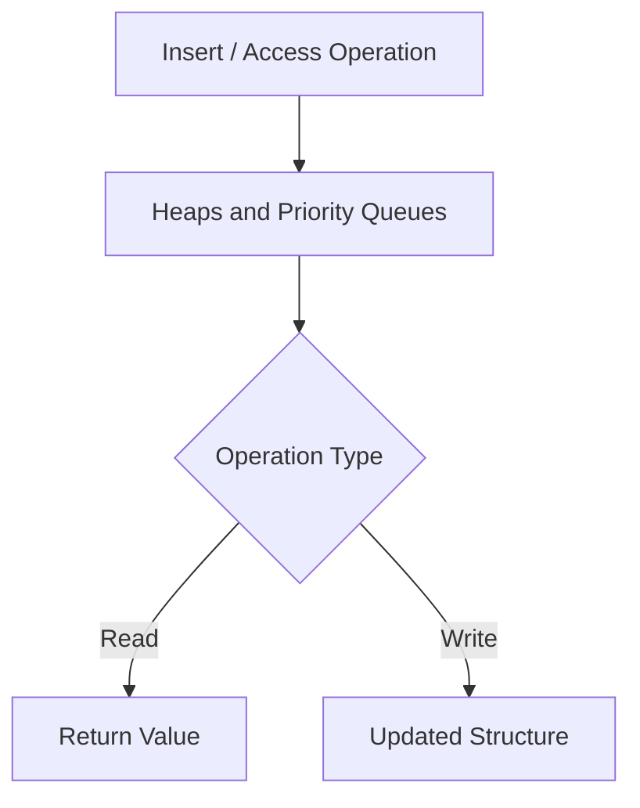

# Heaps and Priority Queues

## 1. Definition
A heap is a tree-based structure satisfying the heap property (each parent is greater/less than its children), commonly used to implement a priority queue that always returns the highest- or lowest-priority element first.

## 2. Why It Matters
Software and web developers need to understand heaps and Priority Queues because it directly affects how
systems are built, maintained, and operated in production. Ignoring it typically shows up later as
bugs, security incidents, performance problems, or unmaintainable code — all more expensive to fix
after the fact than to design for up front.

## 3. Core Concepts
- The core mechanism described in the Definition above
- Its role within Data Structures
- Its inputs, outputs, and success criteria
- How it interacts with the neighboring concepts in Related Topics below

## 4. How It Works
Heaps and Priority Queues operates by taking a defined input or trigger, applying its core mechanism, and producing an
outcome that other parts of the system depend on. The general shape of that flow is shown in the
diagram below.

## 5. Architecture
Where heaps and Priority Queues has an architectural shape, it typically sits at a specific layer of a system
(client, service, or data layer) with clear boundaries and responsibilities relative to the components
around it — see the Architecture/Workflow diagram for the concrete shape.

## 6. Workflow


## 7. Practical Example
A realistic scenario: a development team applies heaps and Priority Queues while building or operating a web
application, needing to balance correctness, delivery speed, and long-term maintainability.

## 8. Code Example
```text
# Illustrative outline for Heaps and Priority Queues
# A concrete implementation depends on your language/stack;
# the mechanics are described in 'How It Works' above.
```

## 9. Common Use Cases
- Used directly within Data Structures work on typical software and web projects
- Appears as a building block inside larger systems covered elsewhere in this knowledge base
- Commonly taught and tested as a core skill at the Intermediate level

## 10. Advantages
- Provides a well-understood, reusable solution to a recurring problem
- Composable with other practices and technologies in a modern stack
- Backed by established industry practice, tooling, and documentation

## 11. Disadvantages
- Can be misapplied or over-engineered if used where it isn't needed
- Adds a learning curve and, in some cases, ongoing maintenance overhead
- Trade-offs (performance, complexity, cost) must be actively managed, not assumed away

## 12. Common Mistakes
- Applying heaps and Priority Queues without understanding the problem it's meant to solve
- Skipping the trade-off analysis and adopting it purely because it's popular
- Failing to revisit the decision as requirements or scale change

## 13. Best Practices
- Understand the problem before reaching for heaps and Priority Queues as the solution
- Keep the implementation as simple as the requirements allow
- Document the decision and its trade-offs for future maintainers (see [[Architecture Decision Records]])

## 14. Security Considerations
Where heaps and Priority Queues touches user input, credentials, or external systems, standard practices from [[Application Security]] apply — validate input, enforce least privilege, and avoid leaking sensitive data in logs or errors.

## 15. Performance Considerations
Heaps and Priority Queues can affect latency, throughput, or resource usage depending on how it's implemented; profile before optimizing, and consult [[Performance Engineering]] for general guidance.

## 16. Scalability Considerations
As load grows, revisit whether heaps and Priority Queues still fits — see [[Scalability]] and [[System Design]] for the broader scaling toolkit.

## 17. Production Considerations
In production, heaps and Priority Queues needs appropriate configuration, monitoring, and rollback plans — treat
it as something to observe and be ready to adjust, not a one-time decision. See [[Production Environment Management]]
and [[Observability]] for the operational side of this.

## 18. Testing
heaps and Priority Queues should be verified with an appropriate mix of [[Unit Testing]], [[Integration Testing]],
and, where user-facing behavior is involved, [[End-to-End Testing]] — matched to the risk and complexity
of the specific implementation.

## 19. Debugging
When heaps and Priority Queues misbehaves, start with logs and [[Stack Traces]] to localize the failure, then
reproduce it in isolation before attempting a fix — see [[Debugging]] for general technique.

## 20. Related Topics
- [[Sets and Maps]]
- [[Trees]]
- [[Graphs]]
- [[Tries]]
- [[Data Structures Overview]]
- [[Algorithms Overview]]
- [[Complexity Analysis (Big O)]]

## 21. Prerequisites
- [[Sets and Maps]]
- [[Trees]]
- [[Data Structures Overview]]

## 22. Next Topics
- [[Graphs]]
- [[Tries]]
- [[Algorithms Overview]]

## 23. Interview Questions
- What problem does Heaps and Priority Queues solve, and what would happen without it?
- What are the main trade-offs of using heaps and Priority Queues compared to the alternatives?
- Can you describe a situation where heaps and Priority Queues would be the wrong choice?
- How would you test and debug an implementation of heaps and Priority Queues?

## 24. Quick Revision
Heaps and Priority Queues: a heap is a tree-based structure satisfying the heap property (each parent is greater/less than its children), commonly used to implement a priority queue that always returns the highest- or lowest-priority element first. Key trade-off notes: Heap insert and extract-min/max: `O(log n)`. Peek at min/max: `O(1)`.

---
*Part of the [[Master-Index|Software + Web Development Common Knowledge Base]] — Category: Data Structures — Level: Intermediate*
