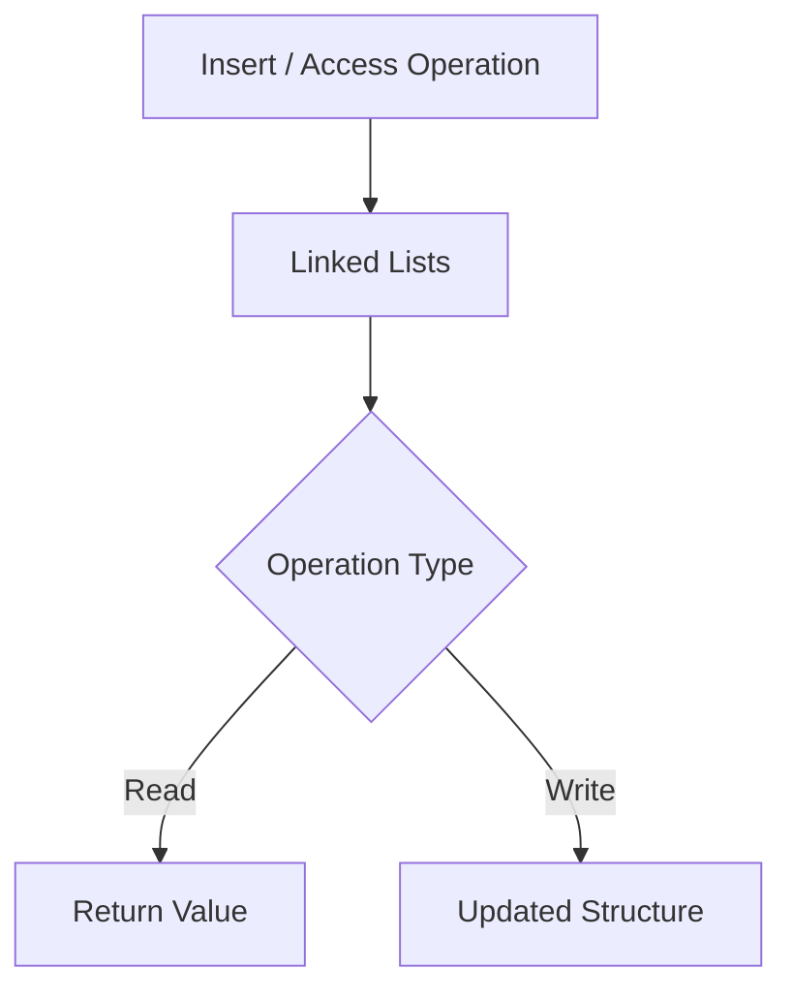

# Linked Lists

## 1. Definition
A linked list is a linear data structure where each element (node) holds a value and a reference to the next node, allowing efficient insertion and deletion without shifting elements.

## 2. Why It Matters
Software and web developers need to understand linked Lists because it directly affects how
systems are built, maintained, and operated in production. Ignoring it typically shows up later as
bugs, security incidents, performance problems, or unmaintainable code — all more expensive to fix
after the fact than to design for up front.

## 3. Core Concepts
- The core mechanism described in the Definition above
- Its role within Data Structures
- Its inputs, outputs, and success criteria
- How it interacts with the neighboring concepts in Related Topics below

## 4. How It Works
Linked Lists operates by taking a defined input or trigger, applying its core mechanism, and producing an
outcome that other parts of the system depend on. The general shape of that flow is shown in the
diagram below.

## 5. Architecture
Where linked Lists has an architectural shape, it typically sits at a specific layer of a system
(client, service, or data layer) with clear boundaries and responsibilities relative to the components
around it — see the Architecture/Workflow diagram for the concrete shape.

## 6. Workflow


## 7. Practical Example
A realistic scenario: a development team applies linked Lists while building or operating a web
application, needing to balance correctness, delivery speed, and long-term maintainability.

## 8. Code Example
```python
class Node:
    def __init__(self, value, next=None):
        self.value = value
        self.next = next

class LinkedList:
    def __init__(self):
        self.head = None
    def prepend(self, value):
        self.head = Node(value, self.head)  # O(1) insert at head
```

## 9. Common Use Cases
- Used directly within Data Structures work on typical software and web projects
- Appears as a building block inside larger systems covered elsewhere in this knowledge base
- Commonly taught and tested as a core skill at the Beginner level

## 10. Advantages
- Provides a well-understood, reusable solution to a recurring problem
- Composable with other practices and technologies in a modern stack
- Backed by established industry practice, tooling, and documentation

## 11. Disadvantages
- Can be misapplied or over-engineered if used where it isn't needed
- Adds a learning curve and, in some cases, ongoing maintenance overhead
- Trade-offs (performance, complexity, cost) must be actively managed, not assumed away

## 12. Common Mistakes
- Applying linked Lists without understanding the problem it's meant to solve
- Skipping the trade-off analysis and adopting it purely because it's popular
- Failing to revisit the decision as requirements or scale change

## 13. Best Practices
- Understand the problem before reaching for linked Lists as the solution
- Keep the implementation as simple as the requirements allow
- Document the decision and its trade-offs for future maintainers (see [[Architecture Decision Records]])

## 14. Security Considerations
Where linked Lists touches user input, credentials, or external systems, standard practices from [[Application Security]] apply — validate input, enforce least privilege, and avoid leaking sensitive data in logs or errors.

## 15. Performance Considerations
Linked Lists can affect latency, throughput, or resource usage depending on how it's implemented; profile before optimizing, and consult [[Performance Engineering]] for general guidance.

## 16. Scalability Considerations
As load grows, revisit whether linked Lists still fits — see [[Scalability]] and [[System Design]] for the broader scaling toolkit.

## 17. Production Considerations
In production, linked Lists needs appropriate configuration, monitoring, and rollback plans — treat
it as something to observe and be ready to adjust, not a one-time decision. See [[Production Environment Management]]
and [[Observability]] for the operational side of this.

## 18. Testing
linked Lists should be verified with an appropriate mix of [[Unit Testing]], [[Integration Testing]],
and, where user-facing behavior is involved, [[End-to-End Testing]] — matched to the risk and complexity
of the specific implementation.

## 19. Debugging
When linked Lists misbehaves, start with logs and [[Stack Traces]] to localize the failure, then
reproduce it in isolation before attempting a fix — see [[Debugging]] for general technique.

## 20. Related Topics
- [[Data Structures Overview]]
- [[Arrays and Strings]]
- [[Stacks and Queues]]
- [[Hash Tables]]
- [[Algorithms Overview]]
- [[Complexity Analysis (Big O)]]

## 21. Prerequisites
- [[Data Structures Overview]]
- [[Arrays and Strings]]

## 22. Next Topics
- [[Stacks and Queues]]
- [[Hash Tables]]
- [[Algorithms Overview]]

## 23. Interview Questions
- What problem does Linked Lists solve, and what would happen without it?
- What are the main trade-offs of using linked Lists compared to the alternatives?
- Can you describe a situation where linked Lists would be the wrong choice?
- How would you test and debug an implementation of linked Lists?

## 24. Quick Revision
Linked Lists: a linked list is a linear data structure where each element (node) holds a value and a reference to the next node, allowing efficient insertion and deletion without shifting elements. Key trade-off notes: Linked list access by index: `O(n)`. Insertion/deletion at the head: `O(1)`.

---
*Part of the [[Master-Index|Software + Web Development Common Knowledge Base]] — Category: Data Structures — Level: Beginner*
