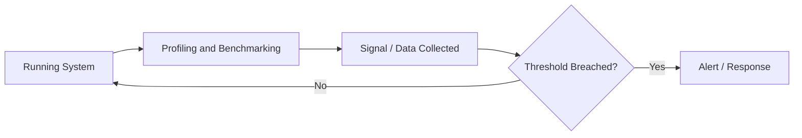

# Profiling and Benchmarking

## 1. Definition
Profiling measures where a program spends time and resources during execution, and benchmarking systematically compares performance under controlled, repeatable conditions.

## 2. Why It Matters
Software and web developers need to understand profiling and Benchmarking because it directly affects how
systems are built, maintained, and operated in production. Ignoring it typically shows up later as
bugs, security incidents, performance problems, or unmaintainable code — all more expensive to fix
after the fact than to design for up front.

## 3. Core Concepts
- The core mechanism described in the Definition above
- Its role within Performance
- Its inputs, outputs, and success criteria
- How it interacts with the neighboring concepts in Related Topics below

## 4. How It Works
Profiling and Benchmarking operates by taking a defined input or trigger, applying its core mechanism, and producing an
outcome that other parts of the system depend on. The general shape of that flow is shown in the
diagram below.

## 5. Architecture
Where profiling and Benchmarking has an architectural shape, it typically sits at a specific layer of a system
(client, service, or data layer) with clear boundaries and responsibilities relative to the components
around it — see the Architecture/Workflow diagram for the concrete shape.

## 6. Workflow


## 7. Practical Example
A realistic scenario: a development team applies profiling and Benchmarking while building or operating a web
application, needing to balance correctness, delivery speed, and long-term maintainability.

## 8. Code Example
```text
# Illustrative outline for Profiling and Benchmarking
# A concrete implementation depends on your language/stack;
# the mechanics are described in 'How It Works' above.
```

## 9. Common Use Cases
- Used directly within Performance work on typical software and web projects
- Appears as a building block inside larger systems covered elsewhere in this knowledge base
- Commonly taught and tested as a core skill at the Advanced level

## 10. Advantages
- Provides a well-understood, reusable solution to a recurring problem
- Composable with other practices and technologies in a modern stack
- Backed by established industry practice, tooling, and documentation

## 11. Disadvantages
- Can be misapplied or over-engineered if used where it isn't needed
- Adds a learning curve and, in some cases, ongoing maintenance overhead
- Trade-offs (performance, complexity, cost) must be actively managed, not assumed away

## 12. Common Mistakes
- Applying profiling and Benchmarking without understanding the problem it's meant to solve
- Skipping the trade-off analysis and adopting it purely because it's popular
- Failing to revisit the decision as requirements or scale change

## 13. Best Practices
- Understand the problem before reaching for profiling and Benchmarking as the solution
- Keep the implementation as simple as the requirements allow
- Document the decision and its trade-offs for future maintainers (see [[Architecture Decision Records]])

## 14. Security Considerations
Where profiling and Benchmarking touches user input, credentials, or external systems, standard practices from [[Application Security]] apply — validate input, enforce least privilege, and avoid leaking sensitive data in logs or errors.

## 15. Performance Considerations
Performance is a primary concern for this topic — see Core Concepts and How It Works above for the specific costs involved.

## 16. Scalability Considerations
As load grows, revisit whether profiling and Benchmarking still fits — see [[Scalability]] and [[System Design]] for the broader scaling toolkit.

## 17. Production Considerations
In production, profiling and Benchmarking needs appropriate configuration, monitoring, and rollback plans — treat
it as something to observe and be ready to adjust, not a one-time decision. See [[Production Environment Management]]
and [[Observability]] for the operational side of this.

## 18. Testing
profiling and Benchmarking should be verified with an appropriate mix of [[Unit Testing]], [[Integration Testing]],
and, where user-facing behavior is involved, [[End-to-End Testing]] — matched to the risk and complexity
of the specific implementation.

## 19. Debugging
When profiling and Benchmarking misbehaves, start with logs and [[Stack Traces]] to localize the failure, then
reproduce it in isolation before attempting a fix — see [[Debugging]] for general technique.

## 20. Related Topics
- [[Resource Management]]
- [[Performance Engineering]]
- [[Load and Stress Testing]]
- [[CPU and Memory Optimization]]
- [[Caching Fundamentals]]
- [[System Design]]

## 21. Prerequisites
- [[Performance Engineering]]
- [[Caching Fundamentals]]
- [[System Design]]

## 22. Next Topics
- [[Resource Management]]
- [[Load and Stress Testing]]
- [[CPU and Memory Optimization]]

## 23. Interview Questions
- What problem does Profiling and Benchmarking solve, and what would happen without it?
- What are the main trade-offs of using profiling and Benchmarking compared to the alternatives?
- Can you describe a situation where profiling and Benchmarking would be the wrong choice?
- How would you test and debug an implementation of profiling and Benchmarking?

## 24. Quick Revision
Profiling and Benchmarking: profiling measures where a program spends time and resources during execution, and benchmarking systematically compares performance under controlled, repeatable conditions. Key trade-off notes: see Advantages/Disadvantages above.

---
*Part of the [[Master-Index|Software + Web Development Common Knowledge Base]] — Category: Performance — Level: Advanced*
